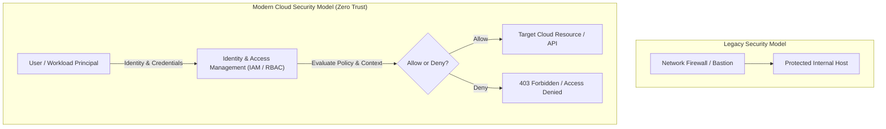
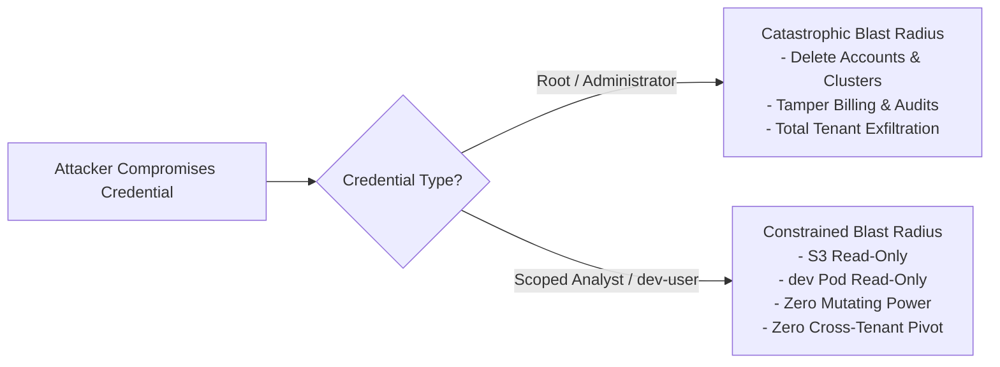
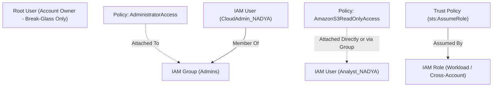
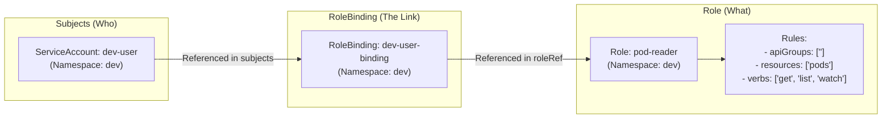
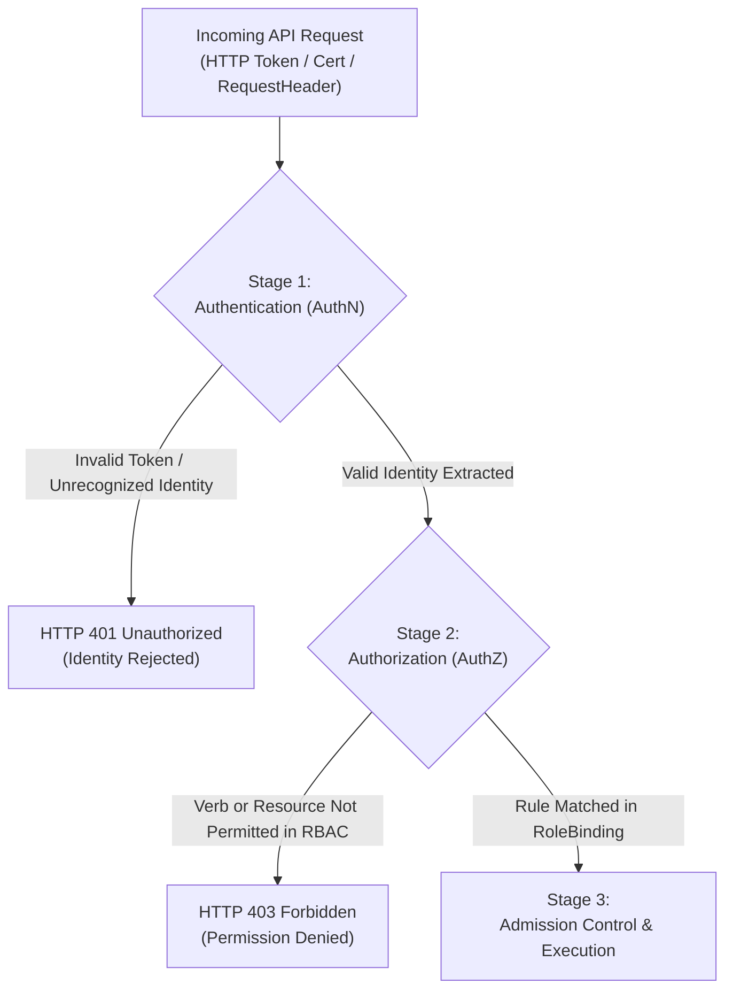
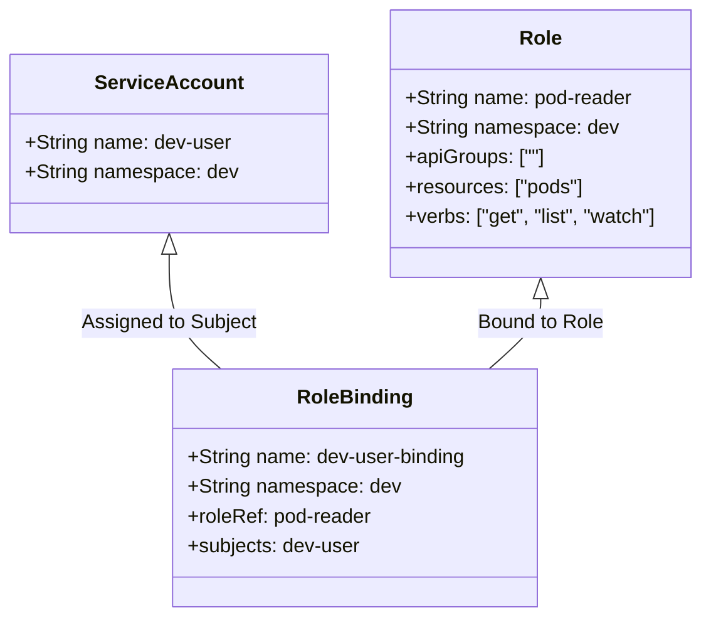

# UNIVERSITI KUALA LUMPUR (UniKL MIIT)
## Malaysian Institute of Information Technology
### IKB42603 Cloud Computing Security Essentials
### Lab Report 1: Cloud Account Security, Identity & Access Management
**Identity Governance and Least Privilege — LocalStack IAM & Kubernetes RBAC**

---

| **Academic Metric / Field** | **Specification Details** |
| :--- | :--- |
| **Student Name** | **NUR IWANI IZZATI BINTI RUHAIZARD** |
| **Student ID** | **52215225392D** |
| **Course Code & Title** | **IKB42603 Cloud Computing Security Essentials** |
| **Program** | Bachelor of Information Technology / Computer Science (Information Security / Cloud Computing) |
| **Lecturer / Instructor** | **Ms Adani** (Lab Manual by Prof. Dr. Shahrulniza Musa) |
| **Lab Module** | **Lab 1 (Weeks 1–2)** |
| **Lab Focus Areas** | **Session A:** Cloud Identity with LocalStack IAM (Tasks 1–4)<br>**Session B:** Enforced Access Control with Kubernetes RBAC (Tasks 5–7) |
| **GitHub Repository** | [nurruhaizard/CLOUD-COMPUTING](https://github.com/nurruhaizard/CLOUD-COMPUTING) |
| **Date of Submission** | **12 September 2026** |

---

## Table of Contents

1. [Executive Summary](#1-executive-summary)
2. [Course & Assessment Mapping](#2-course--assessment-mapping)
3. [Theoretical Foundations & Architecture Overview](#3-theoretical-foundations--architecture-overview)
   - [3.1 Identity as the Cloud Security Perimeter](#31-identity-as-the-cloud-security-perimeter)
   - [3.2 The Principle of Least Privilege & Blast-Radius Reduction](#32-the-principle-of-least-privilege--blast-radius-reduction)
   - [3.3 Cloud Identity Hierarchy (Users, Groups, Policies, Roles)](#33-cloud-identity-hierarchy-users-groups-policies-roles)
   - [3.4 Credential Hygiene & Access Key Lifecycles](#34-credential-hygiene--access-key-lifecycles)
   - [3.5 Kubernetes RBAC Authorization Engine](#35-kubernetes-rbac-authorization-engine)
   - [3.6 Authentication (AuthN) vs. Authorization (AuthZ) Pipeline](#36-authentication-authn-vs-authorization-authz-pipeline)
4. [Technical Prerequisites & Environment Setup](#4-technical-prerequisites--environment-setup)
5. [Session A (Week 1) — Cloud Identity with LocalStack IAM](#5-session-a-week-1--cloud-identity-with-localstack-iam)
   - [One-Time Environment Setup](#one-time-environment-setup)
   - [Task 1 — Map the Cloud Identity Landscape](#task-1--map-the-cloud-identity-landscape)
   - [Task 2 — Create a Least-Privilege Admin (Stop Using Root)](#task-2--create-a-least-privilege-admin-stop-using-root)
   - [Task 3 — Enforce Least Privilege with a Scoped Policy](#task-3--enforce-least-privilege-with-a-scoped-policy)
   - [Task 4 — Credential Hygiene & Access Keys](#task-4--credential-hygiene--access-keys)
6. [Session B (Week 2) — Enforced Access Control with Kubernetes RBAC](#6-session-b-week-2--enforced-access-control-with-kubernetes-rbac)
   - [Cluster Setup with kind](#cluster-setup-with-kind)
   - [Task 5 — Separate Environments with Namespaces](#task-5--separate-environments-with-namespaces)
   - [Task 6 — Define a Role and Bind It (Least Privilege)](#task-6--define-a-role-and-bind-it-least-privilege)
   - [Task 7 — Test That Access Control Works](#task-7--test-that-access-control-works)
7. [Deliverables & Assessment Short-Answer Questions](#7-deliverables--assessment-short-answer-questions)
   - [Section 1: Deliverable Screenshot Matrix](#section-1-deliverable-screenshot-matrix)
   - [Section 2: Short-Answer Questions (Q1 – Q5)](#section-2-short-answer-questions-q1--q5)
   - [Section 3: Verification Command Output](#section-3-verification-command-output)
8. [Security Best-Practices Checklist](#8-security-best-practices-checklist)
9. [Cleanup & Teardown Procedures](#9-cleanup--teardown-procedures)
10. [Advanced Expansion & Hardening Recommendations](#10-advanced-expansion--hardening-recommendations)
11. [References & Industry Security Standards](#11-references--industry-security-standards)

---

## 1. Executive Summary

In traditional on-premises enterprise environments, security models relied heavily on rigid physical perimeters, bastion hosts, and network firewall appliances. However, in modern multi-tenant cloud ecosystems, workloads are distributed across virtualized compute nodes, managed container orchestration platforms, and software-defined abstractions. As a result, the physical perimeter has evaporated, and **Identity and Access Management (IAM)** has become the primary control plane and definitive boundary of cloud security.

This laboratory report presents an end-to-end, hands-on implementation and security analysis of **Lab 1: Cloud Account Security, Identity & Access Management** within the **IKB42603 Cloud Computing Security Essentials** curriculum at Universiti Kuala Lumpur (UniKL MIIT). Executed across two structured sessions, this laboratory establishes the theoretical foundations and operational mechanics of cloud identity governance and access control enforcement:

1. **Session A (Week 1) — Cloud Identity Governance with LocalStack IAM:**
   - **Eliminating Root Account Liability:** Replaced dangerous daily root account operations with a dedicated administrative IAM identity (`CloudAdmin_NADYA`), implementing access rights through an administrative group (`Admins`) attached with the managed `AdministratorAccess` policy.
   - **Scoped Least-Privilege Authorization:** Provisioned an operational identity (`Analyst_NADYA`) bound strictly to a fine-grained, read-only policy (`AmazonS3ReadOnlyAccess`), mathematically constraining the principal from modifying infrastructure or reading unrelated services.
   - **Credential Hygiene & Access Key Lifecycle:** Generated programmatic access keys (`LKIAQAAAAAALEF5QZ43`), inspected credential metadata, and demonstrated immediate credential invalidation by deactivating the key status to `Inactive`.

2. **Session B (Week 2) — Enforced Access Control with Kubernetes RBAC:**
   - **Cluster Provisioning:** Initialized an ephemeral, multi-node capable Kubernetes cluster (`ccse-lab1`) using `kind` (Kubernetes-in-Docker).
   - **Multi-Tenant Logical Isolation:** Partitioned the Kubernetes cluster into isolated logical environments (`dev` and `prod`) using Kubernetes Namespaces.
   - **Granular Role-Based Access Control (RBAC):** Created an in-cluster service identity (`dev-user` ServiceAccount), constructed a tightly scoped `Role` (`pod-reader` restricted to `get`, `list`, and `watch` verbs on `pods`), and bound the role to the service account via a namespaced `RoleBinding` (`dev-user-binding`).
   - **Policy Enforcement & Boundary Verification:** Validated the access control boundaries using `kubectl auth can-i`, proving that read operations within the authorized namespace succeed (`yes`), while unauthorized mutating operations (`delete pods` $\rightarrow$ `no`) and cross-namespace traversals (`list pods -n prod` $\rightarrow$ `no`) are deterministically blocked by the Kubernetes API server authorization engine.

All practical steps were executed within a Linux laboratory environment, substantiated through forensic terminal captures, and synchronized to the student's central repository: **[nurruhaizard/CLOUD-COMPUTING](https://github.com/nurruhaizard/CLOUD-COMPUTING)**.

---

## 2. Course & Assessment Mapping

| Assessment Element | Academic Curriculum Specification |
| :--- | :--- |
| **Course Learning Outcome (CLO)** | **CLO2** — Construct secure cloud operations that safeguard data integrity |
| **Lecture Topics Aligned** | **Weeks 1–2** (Fundamentals, Security Architecture) · **Weeks 5 & 7** (Access Control, Identity) |
| **Value / Skill Clusters** | **VBE3** (Integrity & Ethical Responsibility) · **SC8** (Integrated Problem-Solving) |
| **Assessment Component** | Comprehensive Laboratory Report (Terminal Outputs, Forensic Screenshots, In-Depth Short-Answer Questions) |
| **Execution Platform** | Linux Environment (Kali Linux), Docker Engine, LocalStack (AWS IAM & STS Emulator), `kind` (Kubernetes-in-Docker), `kubectl`, AWS CLI v2 |

```
+---------------------------------------------------------------------------------------------------+
|               IKB42603 LAB 1: CLOUD ACCOUNT SECURITY, IDENTITY & ACCESS MANAGEMENT                |
+---------------------------------------------------------------------------------------------------+
|               SESSION A (WEEK 1)               |               SESSION B (WEEK 2)                 |
|       "Cloud Identity Governance & IAM"        |       "Enforced Access Control with RBAC"        |
+------------------------------------------------+--------------------------------------------------+
|  Setup: Docker & LocalStack Initialization     |  Setup: kind Kubernetes Cluster Deployment       |
|  Task 1: Map the Cloud Identity Landscape      |  Task 5: Separate Environments with Namespaces   |
|  Task 2: Least-Privilege Admin (Stop Root)     |  Task 6: Define a Role and Bind It (RBAC)        |
|  Task 3: Enforce Scoped Least-Privilege Policy |  Task 7: Test Access Control Boundary (can-i)    |
|  Task 4: Credential Hygiene & Access Key Mgmt  |  Verification: RoleBinding YAML Inspection       |
+------------------------------------------------+--------------------------------------------------+
```

---

## 3. Theoretical Foundations & Architecture Overview

### 3.1 Identity as the Cloud Security Perimeter

In traditional data center architectures, firewalls and network segmentation formed a castle-and-moat perimeter. Within modern cloud architectures (IaaS, PaaS, SaaS), resources are accessible via public REST APIs authenticated through cryptographic tokens and access keys. If an attacker acquires administrative credentials, network firewalls offer zero defensive resistance. Therefore, **identity is the new perimeter**. Proper identity governance establishes who is allowed to authenticate, what actions they can execute, and under what conditions their sessions remain valid.



### 3.2 The Principle of Least Privilege & Blast-Radius Reduction

The **Principle of Least Privilege (PoLP)** dictates that any identity—whether human user, system process, or containerized workload—must only possess the absolute minimum set of privileges necessary to execute its legitimate business function, and strictly for the minimum required duration.

#### Blast Radius Reduction
The *blast radius* describes the maximum potential damage an adversary can inflict when a specific credential or component is compromised.
- **Root / Full Administrator Compromise:** Complete cloud tenant takeover, total data exfiltration, resource destruction, financial sabotage, and persistent backdoor creation (unbounded blast radius).
- **Least-Privilege Scoped Identity Compromise:** Confined strictly to the authorized verbs and resources (e.g., read-only access to S3 objects). The adversary cannot delete data, manipulate IAM roles, pivot to compute instances, or modify network policies (strictly bounded blast radius).



### 3.3 Cloud Identity Hierarchy (Users, Groups, Policies, Roles)

AWS IAM constructs represent distinct building blocks designed to partition administrative responsibility:



- **Root User:** The foundational identity created during tenant inception. Possesses immutable, unrestricted superuser privileges across all billing, account closure, and cryptographic resources. Must never be used for everyday administration.
- **IAM User:** A persistent identity representing a specific human or system requiring long-term interactive console access or programmatic API credentials.
- **IAM Policy:** A formal JSON document explicitly declaring permissions through `Effect` (`Allow`/`Deny`), `Action` (API operations), `Resource` (Amazon Resource Names - ARNs), and optional `Condition` blocks.
- **IAM Group:** A collection of IAM users used to grant bulk permissions, preventing permission sprawl and streamlining privilege auditing.
- **IAM Role:** An identity with attached permission policies that is not tied to a specific user and has no long-term credentials. Instead, trusted principals dynamically assume roles via the AWS Security Token Service (STS) to obtain short-lived cryptographic credentials.

### 3.4 Credential Hygiene & Access Key Lifecycles

Programmatic interactions with cloud APIs rely on **Access Key IDs** and **Secret Access Keys**. Unlike console passwords, access keys do not expire automatically unless governed by organizational policies.

1. **Risks of Long-Lived Access Keys:**
   - Accidental source code leaks (e.g., hardcoding keys into public GitHub repositories).
   - Insecure storage in local configuration files (`~/.aws/credentials`) vulnerable to workstation compromise.
   - Absence of automated credential expiration.
2. **Credential Rotation Strategy:**
   - Generate a secondary active key for the target identity.
   - Update client software configurations to utilize the newly minted key.
   - Deactivate the legacy key (`Status: Inactive`) to verify that no operational workflows are broken.
   - Permanently delete the deprecated key once stability is proven.
   - Mandate short-lived STS temporary credentials and instance profiles wherever feasible.

### 3.5 Kubernetes RBAC Authorization Engine

Kubernetes implements native **Role-Based Access Control (RBAC)** to govern interactions with the Kubernetes API server. The engine processes incoming REST requests through a strict policy matrix:



- **Subject:** The entity requesting access. Can be a human user (`User`), an organizational group (`Group`), or an automated container process identity (`ServiceAccount`).
- **Role:** A namespace-scoped resource defining an additive whitelist of allowed operations (`verbs`: `get`, `list`, `watch`, `create`, `update`, `delete`) on target objects (`resources`: `pods`, `services`, `secrets`).
- **RoleBinding:** The authoritative binding mechanism that grants the permissions defined in a `Role` to one or more `Subjects` strictly within the specified namespace.
- **ClusterRole & ClusterRoleBinding:** The cluster-wide equivalents that apply to non-namespaced resources (e.g., `nodes`, `persistentvolumes`, `namespaces`) or cluster-wide scopes across all namespaces.

### 3.6 Authentication (AuthN) vs. Authorization (AuthZ) Pipeline

Every request directed to the Kubernetes API server traverses a sequential security gate:



1. **Authentication (AuthN) — "Who are you?":** The API server extracts credentials (X.509 client certificate, Bearer Token, OpenID Connect JWT) and maps the connection to a known username and group. If authentication succeeds, the request moves to Stage 2.
2. **Authorization (AuthZ) — "What are you allowed to do?":** The API server queries the configured authorization authorizers (primarily Node and RBAC). It evaluates whether the authenticated subject possesses a matching `RoleBinding` granting the requested `verb` on the target `resource` in the target `namespace`. If no rule grants permission, the request is terminated with `HTTP 403 Forbidden` by default (closed-world / default-deny assumption).

---

## 4. Technical Prerequisites & Environment Setup

The laboratory exercises were conducted on a Linux workstation configured with the following toolchain:

| Software Component | Verified Version / Utility | Purpose in Lab |
| :--- | :--- | :--- |
| **Operating System** | Kali Linux (Kernel 6.x+) | Secure, reproducible execution environment |
| **Docker Engine** | Docker Community v24+ | Container runtime for LocalStack and kind nodes |
| **LocalStack** | `localstack/localstack:latest` | Local AWS API emulator for IAM, STS, and CloudWatch |
| **AWS CLI v2** | `aws-cli/2.x` | Command-line interface targeting LocalStack endpoints |
| **kind** | Kubernetes-in-Docker v0.20+ | Multi-node Kubernetes cluster emulator in Docker |
| **kubectl** | Kubernetes CLI v1.28+ | Cluster administration and RBAC policy inspector |

---

## 5. Session A (Week 1) — Cloud Identity with LocalStack IAM

### One-Time Environment Setup

#### Step 1: Docker Daemon Verification
Docker was verified to ensure the container runtime was operational and responsive:

```bash
sudo docker ps
```

##### Terminal Output Transcript:
```text
CONTAINER ID   IMAGE                   COMMAND                  CREATED          STATUS                    PORTS                                                                                  NAMES
338dad3f13d9   localstack/localstack   "docker-entrypoint.sh"   About a minute ago   Up About a minute (healthy)   53/tcp, 0.0.0.0:4510-4559->4510-4559/tcp, 443/tcp, 5678/tcp, 0.0.0.0:4566->4566/tcp   localstack
```

##### Screenshot Evidence — Docker Service Status:
<p align="center">
  
</p>

*Figure 1: Verification of active Docker engine and the LocalStack emulator container.*

---

#### Step 2: LocalStack Container Initialization & Health Inspection
LocalStack was initiated in detached mode, binding port `4566` (the unified AWS API gateway for LocalStack). The internal health status of emulated services was queried via the REST management endpoint:

```bash
# Start LocalStack container
docker run -d --name localstack -p 4566:4566 localstack/localstack

# Query service health
curl http://localhost:4566/_localstack/health
```

##### Terminal Output Transcript:
```json
{
  "features": {"persistence": "disabled"},
  "services": {
    "iam": "running",
    "sts": "running",
    "s3": "available",
    "cloudwatch": "available",
    "logs": "available"
  },
  "edition": "pro",
  "version": "2026.7.1"
}
```

##### Screenshot Evidence — LocalStack Health Check:
<p align="center">
  
</p>

*Figure 2: Output of LocalStack health endpoint confirming `iam` and `sts` services are actively running.*

---

#### Step 3: AWS CLI Configuration & Initial Caller Identity Verification
Because LocalStack emulates AWS locally, dummy credentials were configured in the local AWS profile. A helper alias variable was established:
```bash
EP='--endpoint-url=http://localhost:4566'
```

Credentials were configured and tested against LocalStack's Security Token Service:

```bash
sudo aws configure set aws_access_key_id test
sudo aws configure set aws_secret_access_key test
sudo aws configure set region us-east-1

# Verify operating identity against LocalStack
sudo aws --endpoint-url=http://localhost:4566 sts get-caller-identity
```

##### Terminal Output Transcript:
```json
{
    "UserId": "000000000000",
    "Account": "000000000000",
    "Arn": "arn:aws:iam::000000000000:root"
}
```

##### Screenshot Evidence — Initial Operating Identity (Deliverable 1.1):
<p align="center">
  
</p>

*Figure 3: Output of `sts get-caller-identity` proving initial operation as the all-powerful root identity (`arn:aws:iam::000000000000:root`).*

---

### Task 1 — Map the Cloud Identity Landscape

To establish proper architectural governance before deploying access controls, the five core pillars of cloud identity management were mapped:

| Concept | AWS Term | Purpose (Academic & Operational Definition) |
| :--- | :--- | :--- |
| **All-powerful owner** | **Root user** | The initial superuser identity created when the cloud account is provisioned. Retains unrestricted, un-revocable administrative power over all resources, account billing, cryptographic master keys, and tenant closures. **Security Mandate:** Must never be used for everyday operational tasks; credentials must be secured behind hardware MFA and locked in a secure vault for emergency "break-glass" recovery only. |
| **Human/app identity** | **IAM User** | A persistent identity entity representing a specific individual employee, developer, or automated application requiring long-term authentication credentials (password for console or access key pair for CLI/SDK). IAM users enable explicit attribution, non-repudiation, and individualized credential management. |
| **Permission bundle** | **IAM Policy** | A formal, machine-readable JSON document that explicitly declares what actions (`Action`) are permitted or denied (`Effect`) against specific cloud resources (`Resource`) under defined contextual restrictions (`Condition`). Policies serve as the authoritative rulebook evaluated during every cloud API request. |
| **Collection of users** | **IAM Group** | An administrative collection mechanism that aggregates multiple IAM users under a common operational role (e.g., `Admins`, `Developers`, `SecurityAuditors`). Permissions attached to an IAM Group are automatically inherited by all members, eliminating permission drift and simplifying bulk auditing. |
| **Temporary identity** | **IAM Role** | A secure identity entity that has permissions attached to it but is not bound to persistent long-term credentials or a single user. Instead, an IAM Role is dynamically assumed by trusted principals (human users, cross-account identities, or compute workloads like EC2/Lambda) via AWS STS to obtain temporary, auto-expiring session tokens. |

---

### Task 2 — Create a Least-Privilege Admin (Stop Using Root)

#### Architectural Rationale
Operating continuously as the root account exposes an enterprise to catastrophic risks. Any terminal misconfiguration, credential leakage, or script error executed by root is immediately fatal. Best practice demands establishing an administrative group with delegated privileges, creating individual named administrator users, and retiring the root account from everyday operations.

#### Implementation Commands:
```bash
EP='--endpoint-url=http://localhost:4566'

# 2.1 Create group and attach AdministratorAccess policy
aws $EP iam create-group --group-name Admins
aws $EP iam attach-group-policy --group-name Admins \
    --policy-arn arn:aws:iam::aws:policy/AdministratorAccess

# 2.2 Create personal admin user
aws $EP iam create-user --user-name CloudAdmin_NADYA

# 2.3 Put the user in the group
aws $EP iam add-user-to-group --group-name Admins \
    --user-name CloudAdmin_NADYA

# 2.4 Verify group membership
aws $EP iam get-group --group-name Admins
```

##### Terminal Output Transcript (Task 2.1 & 2.2):
```text
aws $EP iam attach-group-policy --group-name Admins \
  --policy-arn arn:aws:iam::aws:policy/AdministratorAccess

aws $EP iam create-user --user-name CloudAdmin_NADYA
{
    "User": {
        "Path": "/",
        "UserName": "CloudAdmin_NADYA",
        "UserId": "AIDAQAAAAAAAUHABWXZ5",
        "Arn": "arn:aws:iam::000000000000:user/CloudAdmin_NADYA",
        "CreateDate": "2026-08-04T09:24:41.138321+00:00"
    }
}
```

##### Screenshot Evidence — Admin Creation & Policy Attachment:
<p align="center">
  
</p>

*Figure 4: Attachment of `AdministratorAccess` policy to `Admins` group and creation of `CloudAdmin_NADYA`.*

---

##### Terminal Output Transcript (Task 2.3 & 2.4 — Deliverable 1.2):
```json
{
    "Users": [
        {
            "Path": "/",
            "UserName": "CloudAdmin_NADYA",
            "UserId": "AIDAQAAAAAAAUHABWXZ5",
            "Arn": "arn:aws:iam::000000000000:user/CloudAdmin_NADYA",
            "CreateDate": "2026-08-04T09:24:41.138321+00:00"
        }
    ],
    "Group": {
        "Path": "/",
        "GroupName": "Admins",
        "GroupId": "AGPAQAAAAAAJDZCYOXVS",
        "Arn": "arn:aws:iam::000000000000:group/Admins",
        "CreateDate": "2026-08-04T09:11:50.795058+00:00"
    }
}
```

##### Screenshot Evidence — Group Membership Verification (Deliverable 1.2):
<p align="center">
  
</p>

*Figure 5: Verification of `CloudAdmin_NADYA` within the `Admins` group via `aws iam get-group`.*

> [!TIP]
> **Security Takeaway:** Attaching access policies directly to groups rather than individual users establishes declarative governance. When permissions require updating, modifying the single group policy instantly cascades to all current and future members, preventing orphaned permissions and reducing administrative audit overhead.

---

### Task 3 — Enforce Least Privilege with a Scoped Policy

#### Architectural Scenario
An organizational teammate requires access to inspect storage data without permission to modify, delete, or reconfigure cloud assets. Granting administrative power would violate least privilege. A scoped identity (`Analyst_NADYA`) is provisioned and restricted strictly to `AmazonS3ReadOnlyAccess`.

#### Implementation Commands:
```bash
# 3.1 Create read-only user
aws $EP iam create-user --user-name Analyst_NADYA

# 3.2 Attach scoped read-only policy
aws $EP iam attach-user-policy --user-name Analyst_NADYA \
    --policy-arn arn:aws:iam::aws:policy/AmazonS3ReadOnlyAccess

# 3.3 Verify attached user policies
aws $EP iam list-attached-user-policies --user-name Analyst_NADYA
```

##### Terminal Output Transcript (Task 3.1):
```json
{
    "User": {
        "Path": "/",
        "UserName": "Analyst_NADYA",
        "UserId": "AIDAQAAAAAAAGLRSZO5V2",
        "Arn": "arn:aws:iam::000000000000:user/Analyst_NADYA",
        "CreateDate": "2026-08-04T10:11:07.586087+00:00"
    }
}
```

##### Screenshot Evidence — Analyst User Creation:
<p align="center">
  
</p>

*Figure 6: Provisioning of the scoped analyst identity `Analyst_NADYA`.*

---

##### Terminal Output Transcript (Task 3.2 & 3.3 — Deliverable 1.3):
```json
{
    "AttachedPolicies": [
        {
            "PolicyName": "AmazonS3ReadOnlyAccess",
            "PolicyArn": "arn:aws:iam::aws:policy/AmazonS3ReadOnlyAccess"
        }
    ]
}
```

##### Screenshot Evidence — Attached Scoped Policies (Deliverable 1.3):
<p align="center">
  
</p>

*Figure 7: Output of `list-attached-user-policies` proving that `Analyst_NADYA` is restricted exclusively to `AmazonS3ReadOnlyAccess`.*

#### Threat Analysis: Blast-Radius Reduction of the Analyst Account
If the credentials for `Analyst_NADYA` were compromised by an external threat actor, the organizational blast radius is tightly constrained:
1. **Read-Only Storage Boundary:** The adversary is strictly confined to read and list operations on Amazon S3 buckets. They can observe storage objects but **cannot delete, overwrite, encrypt (ransomware), or upload malicious payloads** to buckets.
2. **Zero Compute / Administrative Pivot:** The attacker possesses **no privileges** over compute resources (EC2, Lambda, EKS), network configurations (VPC, Security Groups), or identity governance (IAM). They cannot create new administrative backdoors, elevate privileges, modify firewall rules, or generate persistence mechanisms.
3. **Comparative Contrast to Admin Breach:** In contrast, if `CloudAdmin_NADYA` or the root account were breached, the adversary could delete all infrastructure, encrypt company backups, exfiltrate sensitive databases, and delete cloud audit logs. Enforcing scoped least privilege reduces the impact from catastrophic enterprise catastrophe to a minor, manageable data confidentiality review.

---

### Task 4 — Credential Hygiene & Access Keys

#### Operational Lifecycle & Programmatic Access
Programmatic interaction via scripts and CLI requires generating cryptographic key pairs. To protect against key sprawl and compromise, credential hygiene requires listing, auditing, rotating, and deactivating keys when obsolete.

#### Implementation Commands:
```bash
# 4.1 Create an access key for the Analyst
aws $EP iam create-access-key --user-name Analyst_NADYA

# 4.2 List access keys to observe AccessKeyId and status
aws $EP iam list-access-keys --user-name Analyst_NADYA

# 4.3 Rotate / Deactivate the old key
aws $EP iam update-access-key --user-name Analyst_NADYA \
    --access-key-id LKIAQAAAAAALEF5QZ43 --status Inactive
```

##### Terminal Output Transcript:
```text
aws $EP iam create-access-key --user-name Analyst_NADYA
{
    "AccessKey": {
        "UserName": "Analyst_NADYA",
        "AccessKeyId": "LKIAQAAAAAALEF5QZ43",
        "Status": "Active",
        "SecretAccessKey": "hH/xl0PEts18ovy6RmBzhSfvMLWBLYLUHmIJEinc",
        "CreateDate": "2026-08-04T10:16:46.270605+00:00"
    }
}

aws $EP iam list-access-keys --user-name Analyst_NADYA
{
    "AccessKeyMetadata": [
        {
            "UserName": "Analyst_NADYA",
            "AccessKeyId": "LKIAQAAAAAALEF5QZ43",
            "Status": "Active",
            "CreateDate": "2026-08-04T10:16:46.270605+00:00"
        }
    ]
}

aws $EP iam update-access-key --user-name Analyst_NADYA \
    --access-key-id LKIAQAAAAAALEF5QZ43 --status Inactive
```

##### Screenshot Evidence — Access Key Creation, Audit, and Deactivation:
<p align="center">
  
</p>

*Figure 8: Creation of access key `LKIAQAAAAAALEF5QZ43`, metadata audit, and successful status rotation to `Inactive`.*

> [!CAUTION]
> **Production Cloud Security Rule:**
> - Never generate access keys on the root account.
> - Never commit access keys to version control systems (e.g., GitHub, GitLab).
> - Deactivating a key before permanent deletion allows organizations to perform a "scream test" to confirm whether any dependent background jobs fail before irrevocable removal.

---

## 6. Session B (Week 2) — Enforced Access Control with Kubernetes RBAC

### Cluster Setup with kind

While LocalStack teaches the declarative structure of IAM policies, it does not strictly enforce permission denials on every endpoint. To demonstrate access control actively blocking unauthorized operations, an isolated Kubernetes cluster was deployed using **kind** (Kubernetes-in-Docker).

#### Implementation Commands:
```bash
# Create local Kubernetes cluster
sudo kind create cluster --name ccse-lab1

# Inspect cluster control plane and node status
sudo kubectl cluster-info --context kind-ccse-lab1
sudo kubectl get nodes
```

##### Terminal Output Transcript:
```text
Creating cluster "ccse-lab1" ...
 ✓ Ensuring node image (kindest/node:v1.35.0) 🖼
 ✓ Preparing nodes 📦 
 ✓ Writing configuration 📜 
 ✓ Starting control-plane 🕹️ 
 ✓ Installing CNI 🔌 
 ✓ Installing StorageClass 💾 
Set kubectl context to "kind-ccse-lab1"
You can now use your cluster with:

kubectl cluster-info --context kind-ccse-lab1

Kubernetes control plane is running at https://127.0.0.1:37677
CoreDNS is running at https://127.0.0.1:37677/api/v1/namespaces/kube-system/services/kube-dns:dns/proxy

NAME                      STATUS   ROLES           AGE   VERSION
ccse-lab1-control-plane   Ready    control-plane   65s   v1.35.0
```

##### Screenshot Evidence — Cluster Creation & Node Health:
<p align="center">
  
</p>

*Figure 9: Deployment of the `ccse-lab1` cluster and verification of the healthy control-plane node.*

---

### Task 5 — Separate Environments with Namespaces

#### Architectural Principle
Namespaces provide virtual cluster segmentation within a shared physical or virtual control plane. By segmenting environments into `dev` (development) and `prod` (production), teams prevent accidental cross-environment modifications and lay the architectural foundation for scoped RBAC policies.

#### Implementation Commands:
```bash
sudo kubectl create namespace dev
sudo kubectl create namespace prod
sudo kubectl get namespaces
```

##### Terminal Output Transcript:
```text
namespace/dev created
namespace/prod created

NAME                 STATUS   AGE
default              Active   2m27s
dev                  Active   28s
kube-node-lease      Active   2m27s
kube-public          Active   2m27s
kube-system          Active   2m27s
local-path-storage   Active   2m10s
prod                 Active   10s
```

##### Screenshot Evidence — Namespace Segregation:
<p align="center">
  
</p>

*Figure 10: Creation and validation of isolated `dev` and `prod` environment namespaces.*

---

### Task 6 — Define a Role and Bind It (Least Privilege)

#### RBAC Implementation
To enforce least privilege, three distinct Kubernetes resources were declared:
1. **ServiceAccount (`dev-user`):** An in-cluster principal representing a developer within the `dev` namespace.
2. **Role (`pod-reader`):** A scoped authorization policy in `dev` allowing only `get`, `list`, and `watch` verbs on the `pods` resource.
3. **RoleBinding (`dev-user-binding`):** The cryptographic glue linking `dev-user` to `pod-reader`.



#### Implementation Commands:
```bash
# 6.1 Create service account
sudo kubectl create serviceaccount dev-user -n dev

# 6.2 Create scoped role allowing read-only pod access
sudo kubectl create role pod-reader -n dev \
    --verb=get,list,watch --resource=pods

# 6.3 Bind role to service account
sudo kubectl create rolebinding dev-user-binding -n dev \
    --role=pod-reader --serviceaccount=dev:dev-user
```

##### Terminal Output Transcript:
```text
serviceaccount/dev-user created
role.rbac.authorization.k8s.io/pod-reader created
rolebinding.rbac.authorization.k8s.io/dev-user-binding created
```

##### Screenshot Evidence — RBAC Role & RoleBinding Provisioning:
<p align="center">
  
</p>

*Figure 11: Declarative provisioning of ServiceAccount `dev-user`, Role `pod-reader`, and RoleBinding `dev-user-binding`.*

---

### Task 7 — Test That Access Control Works

#### Empirical Boundary Testing with `kubectl auth can-i`
The Kubernetes API server provides the diagnostic command `kubectl auth can-i` to simulate authorization requests as a specific subject without issuing actual state-altering mutations.

The fully qualified service account identifier was assigned:
```bash
SA=system:serviceaccount:dev:dev-user
```

Three definitive tests were performed:
1. **Permitted Action:** Reading pods in `dev` (Expected: **yes**)
2. **Unauthorized Verb:** Deleting pods in `dev` (Expected: **no**)
3. **Unauthorized Scope:** Accessing pods in `prod` (Expected: **no**)

#### Implementation Commands:
```bash
SA=system:serviceaccount:dev:dev-user

# Test 1: Should be YES (reading pods in dev is allowed)
sudo kubectl auth can-i list pods -n dev --as=$SA

# Test 2: Should be NO (deleting pods is not granted)
sudo kubectl auth can-i delete pods -n dev --as=$SA

# Test 3: Should be NO (the role does not extend to prod)
sudo kubectl auth can-i list pods -n prod --as=$SA
```

##### Terminal Output Transcript:
```text
┌──(kali㉿kali)-[~]
└─$ SA=system:serviceaccount:dev:dev-user
┌──(kali㉿kali)-[~]
└─$ sudo kubectl auth can-i list pods -n dev --as=$SA
yes
┌──(kali㉿kali)-[~]
└─$ sudo kubectl auth can-i delete pods -n dev --as=$SA
no
┌──(kali㉿kali)-[~]
└─$ sudo kubectl auth can-i list pods -n prod --as=$SA
no
```

##### Screenshot Evidence — Access Control Boundary Verification (Deliverable 1.4):
<p align="center">
  
</p>

*Figure 12: Empirical proof of RBAC enforcement: `dev-user` is authorized to list pods in `dev` (`yes`), but strictly blocked from deleting pods (`no`) or accessing `prod` (`no`).*

---

#### Comprehensive Security Analysis: Authentication vs. Authorization

When `kubectl auth can-i` evaluates the requests for `system:serviceaccount:dev:dev-user`:

| Step / Action Evaluated | Authentication (AuthN) Status | Authorization (AuthZ) Status | Decision Reason / Mechanism |
| :--- | :---: | :---: | :--- |
| **`list pods -n dev`** | **PASS** | **ALLOW (`yes`)** | Identity authenticated as `dev-user`; `RoleBinding` matches `dev-user` to `pod-reader`, which explicitly allows verb `list` on resource `pods` in namespace `dev`. |
| **`delete pods -n dev`** | **PASS** | **DENY (`no`)** | Identity authenticated successfully; however, `pod-reader` only grants `get, list, watch`. The verb `delete` is absent, triggering default-deny. |
| **`list pods -n prod`** | **PASS** | **DENY (`no`)** | Identity authenticated successfully; however, `dev-user-binding` is strictly scoped to namespace `dev`. No RoleBinding exists for `dev-user` in namespace `prod`, blocking cross-namespace traversal. |

##### Answering the Manual Question:
- **Which step is the service account passing?**
  The service account passes the **Authentication (AuthN)** step in all three scenarios. The Kubernetes API server successfully authenticates the identity as `system:serviceaccount:dev:dev-user` without error.
- **Which step is blocking the delete and the prod access?**
  The **Authorization (AuthZ)** engine blocks both actions. Because Kubernetes RBAC operates on a strict **default-deny** model, any request lacking an explicit affirmative grant in an active `RoleBinding` or `ClusterRoleBinding` is denied immediately with HTTP 403 Forbidden.

---

## 7. Deliverables & Assessment Short-Answer Questions

### Section 1: Deliverable Screenshot Matrix

| Deliverable ID | Academic Manual Requirement | Screenshot File Name | Visual Evidence Reference |
| :---: | :--- | :--- | :--- |
| **1.1** | Output of `sts get-caller-identity` showing operating identity (root) | `Evidence/dummy credentials.png` | [Figure 3](#screenshot-evidence--initial-operating-identity-deliverable-11) |
| **1.2** | `get-group Admins` output showing `CloudAdmin` user as member | `Evidence/%23%202.3%20Put%20the%20user%20in%20the%20group%20%23%202.4%20Verify%20the%20membership.png` | [Figure 5](#screenshot-evidence--group-membership-verification-deliverable-12) |
| **1.3** | `list-attached-user-policies` for Analyst showing only read-only policy | `Evidence/%23%203.3%20List%20what%20the%20user%20can%20do.png` | [Figure 7](#screenshot-evidence--attached-scoped-policies-deliverable-13) |
| **1.4** | The three `kubectl auth can-i` results (`YES` / `NO` / `NO`) | `Evidence/Task 7 — Test That Access Control Works.png` | [Figure 12](#screenshot-evidence--access-control-boundary-verification-deliverable-14) |

---

### Section 2: Short-Answer Questions (Q1 – Q5)

#### Q1. Why is attaching policies to groups better than attaching them directly to users?
Attaching policies to IAM Groups rather than individual IAM Users is an industry best practice for several critical architectural reasons:
1. **Scalability & Consistency:** In organizations with dozens or thousands of employees, attaching policies individually leads to severe configuration inconsistency. Defining a group policy ensures every engineer in that department receives identical, auditable baseline permissions.
2. **Elimination of Privilege Creep (Permission Drift):** When employees transfer between teams or change job functions, individual user policies are frequently forgotten and accumulate indefinitely. With group-based assignment, simply removing the user from one group and adding them to another instantly updates their effective permissions.
3. **Auditability & Reduced Overhead:** Security compliance auditors only need to inspect the policies bound to a small number of groups rather than auditing thousands of disparate user-level policy attachments. Modifying a single group policy immediately updates all constituent members without touching individual accounts.

---

#### Q2. What is the difference between an IAM User and an IAM Role?
While both represent identities in AWS IAM, they differ fundamentally in credential longevity, usage patterns, and security semantics:

| Characteristic | IAM User | IAM Role |
| :--- | :--- | :--- |
| **Nature of Identity** | Persistent identity associated with a single human or service. | Temporary identity intended to be assumed by trusted entities. |
| **Credentials** | Long-term credentials (username/password and/or permanent Access Key pairs). | No long-term credentials. Provides short-lived, dynamically generated session tokens via AWS STS. |
| **Intended Use Case** | Interactive administrator/developer access to management consoles or legacy CLI scripts. | Automated workloads (EC2 instance profiles, Lambda functions, Kubernetes pods), cross-account access, and federated SSO. |
| **Compromise Risk** | High risk if access keys are hardcoded into git repositories or leaked. | Low risk; session tokens expire automatically within minutes or hours. |
| **Delegation Mechanism**| Direct assignment via group or user policy. | Assumed dynamically via `sts:AssumeRole` governed by a Trust Policy. |

---

#### Q3. Explain least privilege using the Analyst account, and how it reduces blast radius if compromised.
The **Principle of Least Privilege (PoLP)** asserts that an identity must be restricted to only the actions necessary to perform its legitimate job function.
- In Task 3, `Analyst_NADYA` was assigned strictly `AmazonS3ReadOnlyAccess`.
- If an adversary acquires the access keys (`LKIAQAAAAAALEF5QZ43`), the **blast radius is tightly restricted**:
  - The attacker can read and list data in S3 buckets.
  - The attacker **cannot delete or overwrite files**, making data destruction or ransomware injection impossible.
  - The attacker **cannot access EC2 instances, RDS databases, or VPC network configurations**.
  - The attacker **cannot modify IAM policies or create new administrative accounts** to establish persistence.
- By contrast, if an administrator account were compromised, the blast radius would encompass total cloud tenant destruction. Thus, least privilege prevents a single compromised credential from causing an existential enterprise disaster.

---

#### Q4. In Kubernetes, what is the difference between a Role and a RoleBinding?
In Kubernetes RBAC, permissions are deliberately decoupled into policy definitions and subject associations:
- **Role:** Defines **WHAT** actions can be performed. It contains a list of whitelist rules composed of `apiGroups`, `resources` (e.g., `pods`, `services`), and `verbs` (e.g., `get`, `list`, `watch`, `create`, `delete`). A `Role` has no knowledge of who will receive those permissions; it is strictly an abstract definition scoped to a single namespace.
- **RoleBinding:** Defines **WHO** receives the permissions defined in the `Role`. It serves as the bridge that connects the `Role` (referenced in `roleRef`) to one or more `Subjects` (such as a `ServiceAccount`, `User`, or `Group`) within a specific namespace. Without a `RoleBinding`, a `Role` remains completely inactive.

---

#### Q5. Why did the developer service account fail to access prod, and which security principle does that demonstrate?
The developer service account (`dev-user`) failed to access the `prod` namespace because:
1. **Namespace Boundary Enforcement:** In Task 6, `dev-user-binding` was created specifically inside the `dev` namespace (`kubectl create rolebinding ... -n dev`), linking `dev-user` to `pod-reader` exclusively within `dev`.
2. **Default-Deny Policy:** Kubernetes RBAC operates on a closed-world assumption where all actions across all namespaces are denied unless an affirmative grant exists. No `RoleBinding` or `ClusterRoleBinding` was ever granted to `dev-user` in the `prod` namespace.
3. **Security Principle Demonstrated:** This demonstrates **Isolation & Compartmentalization (Multi-Tenant Containment)** and the **Principle of Least Privilege**. Developers are given access strictly to their own operational sandbox (`dev`), preventing accidental disruptions, credential abuse, or unauthorized inspection of mission-critical production workloads (`prod`).

---

### Section 3: Verification Command Output

To mathematically verify that the Kubernetes RBAC enforcement mechanism is active, the detailed configuration of `dev-user-binding` was inspected in YAML format:

```bash
sudo kubectl get rolebinding dev-user-binding -n dev -o yaml
```

##### Terminal Output Transcript (YAML):
```yaml
apiVersion: rbac.authorization.k8s.io/v1
kind: RoleBinding
metadata:
  creationTimestamp: "2026-08-04T10:28:45Z"
  name: dev-user-binding
  namespace: dev
  resourceVersion: "823"
  uid: 93864742-432e-4cc0-a666-391a47aec782
roleRef:
  apiGroup: rbac.authorization.k8s.io
  kind: Role
  name: pod-reader
subjects:
- kind: ServiceAccount
  name: dev-user
  namespace: dev
```

##### Screenshot Evidence — RoleBinding YAML Verification:
<p align="center">
  
</p>

*Figure 13: Full YAML representation of `dev-user-binding` confirming roleRef mapping to `pod-reader` and subject mapping to `dev-user` in namespace `dev`.*

#### YAML Structural Analysis:
- `metadata.namespace`: Confirms that the binding is strictly namespaced within `dev`.
- `roleRef`: Points immutably to `kind: Role` named `pod-reader` within the `rbac.authorization.k8s.io` API group.
- `subjects`: Explicitly enumerates `kind: ServiceAccount` named `dev-user` in namespace `dev` as the sole authorized identity.

---

## 8. Security Best-Practices Checklist

| Security Control / Standard | Implementation Verification | Status |
| :--- | :--- | :---: |
| **Root Account Deprecation** | Daily administrative tasks executed through `CloudAdmin_NADYA`; root account restricted to initial verification. | :white_check_mark: Complete |
| **Group-Based Privilege Delegation** | Permissions assigned via the `Admins` group using managed policy `AdministratorAccess`, avoiding direct user attachments. | :white_check_mark: Complete |
| **Scoped Least-Privilege Identity** | Operational identity `Analyst_NADYA` created and locked to `AmazonS3ReadOnlyAccess`. | :white_check_mark: Complete |
| **Credential Hygiene & Key Rotation** | Programmatic access key `LKIAQAAAAAALEF5QZ43` audited and successfully transitioned to `Inactive` status. | :white_check_mark: Complete |
| **RBAC Default-Deny Enforcement** | Kubernetes RBAC actively blocked unauthorized deletion (`delete pods` $\rightarrow$ `no`) and cross-namespace traversal (`prod` $\rightarrow$ `no`). | :white_check_mark: Complete |

---

## 9. Cleanup & Teardown Procedures

To prevent resource exhaustion and ensure secure posture cleanup on the local workstation, the following commands decommission the test environment:

```bash
# 1. Delete the ephemeral Kubernetes cluster
sudo kind delete cluster --name ccse-lab1

# 2. Stop and remove the LocalStack container
sudo docker stop localstack && sudo docker rm localstack
```

---

## 10. Advanced Expansion & Hardening Recommendations

For enterprise cloud environments, the following advanced security extensions are recommended:

### 1. Infrastructure as Code (IaC) with HashiCorp Terraform
Rather than executing imperative AWS CLI commands, enterprise IAM should be declared immutably via Terraform:
```hcl
resource "aws_iam_group" "admins" {
  name = "Admins"
}

resource "aws_iam_group_policy_attachment" "admin_attach" {
  group      = aws_iam_group.admins.name
  policy_arn = "arn:aws:iam::aws:policy/AdministratorAccess"
}

resource "aws_iam_user" "cloud_admin" {
  name = "CloudAdmin_NADYA"
}

resource "aws_iam_user_group_membership" "admin_membership" {
  user   = aws_iam_user.cloud_admin.name
  groups = [aws_iam_group.admins.name]
}
```

### 2. Context-Aware Policy Conditions (MFA Enforcement)
IAM policies can be reinforced with conditional enforcement rules requiring hardware MFA before granting mutating actions:
```json
{
  "Version": "2012-10-17",
  "Statement": [
    {
      "Sid": "BlockAllUnlessMFAEnforced",
      "Effect": "Deny",
      "Action": "*",
      "Resource": "*",
      "Condition": {
        "BoolIfExists": {
          "aws:MultiFactorAuthPresent": "false"
        }
      }
    }
  ]
}
```

### 3. Policy-as-Code Guardrails with OPA Gatekeeper / Kyverno
In Kubernetes, RBAC permissions can be complemented by admission controllers such as **Open Policy Agent (OPA) Gatekeeper** to reject pods running as root or enforce read-only root filesystems regardless of who deploys them.

---

## 11. References & Industry Security Standards

1. **Course Materials:** Prof. Dr. Shahrulniza Musa & Ms Adani, *IKB42603 Cloud Computing Security Essentials*, Lab Manual 1: Cloud Account Security, Identity & Access Management, Universiti Kuala Lumpur (UniKL MIIT).
2. **NIST SP 800-207:** National Institute of Standards and Technology, *Zero Trust Architecture*, U.S. Department of Commerce, 2020.
3. **AWS Security Best Practices:** Amazon Web Services, *Security Best Practices in IAM*, AWS Documentation: `https://docs.aws.amazon.com/IAM/latest/UserGuide/best-practices.html`.
4. **Kubernetes RBAC Reference:** Cloud Native Computing Foundation, *Using RBAC Authorization*, Kubernetes Official Documentation: `https://kubernetes.io/docs/reference/access-authn-authz/rbac/`.
5. **CSA Security Guidance v5:** Cloud Security Alliance, *Security Guidance for Critical Areas of Focus in Cloud Computing*, Domain 5: Identity, Entitlement and Access Management.
