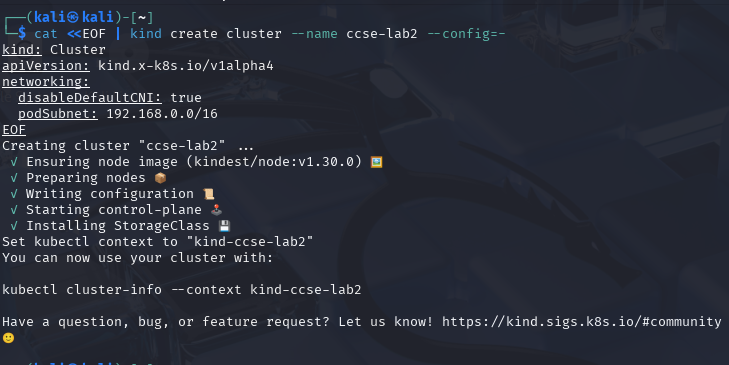
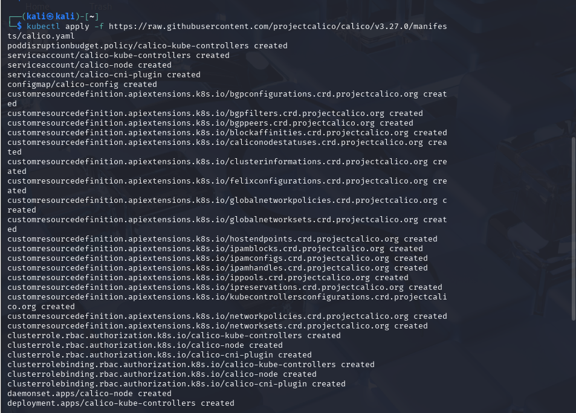
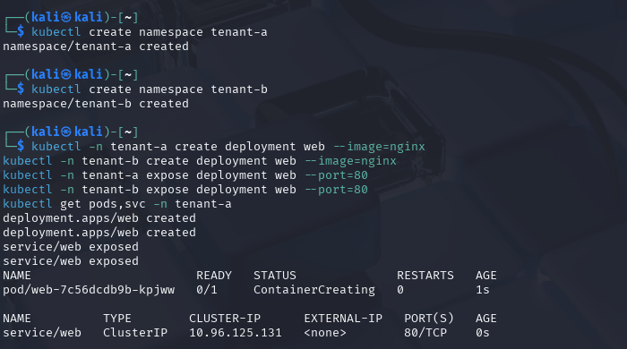
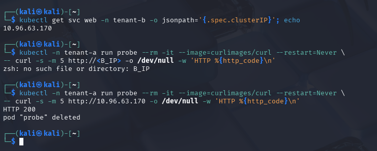
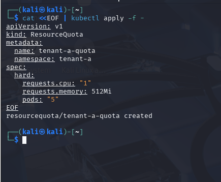
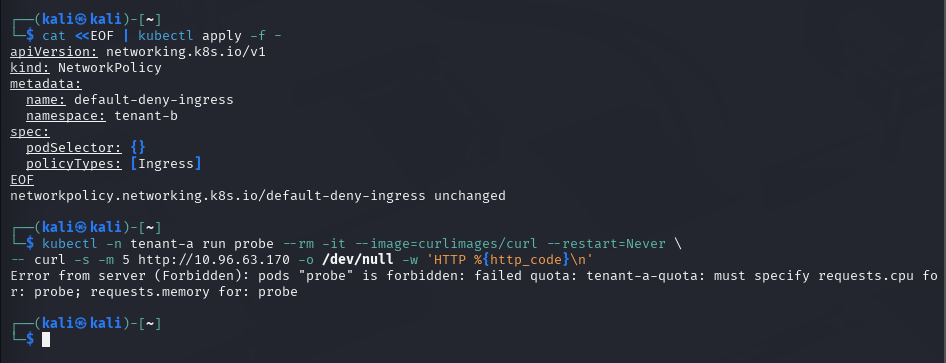
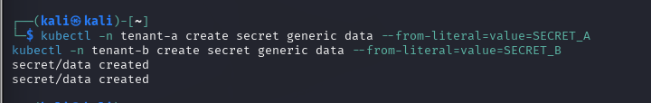
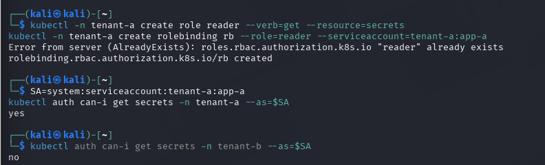
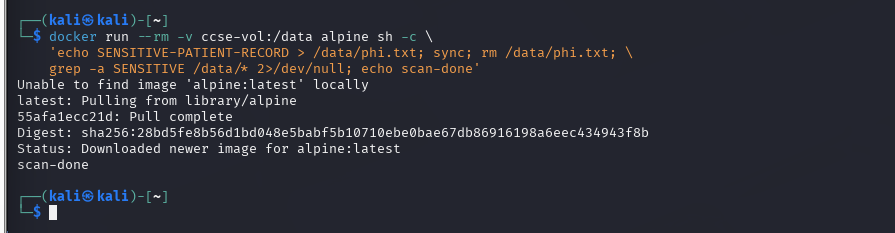
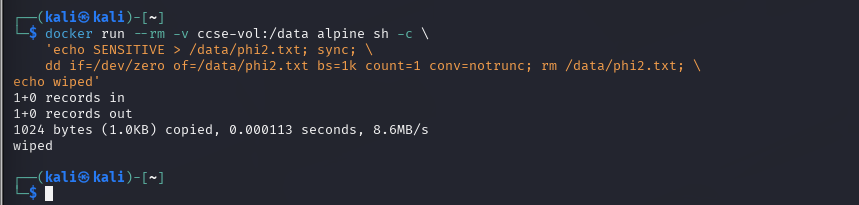

# UNIVERSITI KUALA LUMPUR (UniKL MIIT)
## Malaysian Institute of Information Technology
### IKB42603 Cloud Computing Security Essentials
### Lab Report 2: Secure Isolation & Multi-Tenancy
**Compute, Network and Storage Isolation — Docker & Kubernetes**

---

| **Item** | **Details** |
| :--- | :--- |
| **Student Name** | NUR IWANI IZZATI BINTI RUHAIZARD |
| **Student ID** | 52215225392D |
| **Course Code** | IKB42603 Cloud Computing Security Essentials |
| **Program** | Bachelor of Information Technology / Computer Science (Information Security / Cloud Computing) |
| **Lecturer / Instructor** | Ms Adani |
| **Lab Assignment** | Lab 2 (Weeks 3–4) |
| **Academic Session** | 2 Sessions over 2 Weeks (Session A & Session B) |
| **GitHub Repository** | [nurruhaizard/CLOUD-COMPUTING](https://github.com/nurruhaizard/CLOUD-COMPUTING) |
| **Date of Submission** | 9 September 2026 |

---

## Table of Contents

1. [Executive Summary](#1-executive-summary)
2. [Course & Assessment Mapping](#2-course--assessment-mapping)
3. [Lab Architecture & Isolation Model](#3-lab-architecture--isolation-model)
4. [Prerequisites & Environment Setup](#4-prerequisites--environment-setup)
   - [Setup: Kind Cluster with Policy Enforcement & Calico CNI](#setup-kind-cluster-with-policy-enforcement--calico-cni)
5. [Session A (Week 3) — Compute Isolation & The Default-Open Risk](#5-session-a-week-3--compute-isolation--the-default-open-risk)
   - [Task 1: Two Tenants on One Cluster](#task-1--two-tenants-on-one-cluster)
   - [Task 2: Observe the Default-Open Risk](#task-2--observe-the-default-open-risk)
   - [Task 3: Contain the Noisy Neighbour (Resource Quotas)](#task-3--contain-the-noisy-neighbour-resource-quotas)
6. [Session B (Week 4) — Network & Storage Isolation](#6-session-b-week-4--network--storage-isolation)
   - [Task 4: Default-Deny Network Isolation](#task-4--default-deny-network-isolation)
   - [Task 5: Storage & Secret Isolation (RBAC)](#task-5--storage--secret-isolation-rbac)
   - [Task 6: Data Remanence & Secure Deletion](#task-6--data-remanence--secure-deletion)
7. [Deliverables & Assessment Short-Answer Questions](#7-deliverables--assessment-short-answer-questions)
   - [Question 1: Default Cross-Namespace Communication & Multi-Tenant Risk](#q1-why-can-containers-in-different-namespaces-reach-each-other-by-default-and-why-is-that-dangerous-in-multi-tenant-cloud)
   - [Question 2: Default-Deny Principle and NetworkPolicy Implementation](#q2-explain-the-default-deny-principle-and-how-your-networkpolicy-implements-it)
   - [Question 3: Virtual Machines vs. Containers Isolation & VM Boundaries](#q3-how-do-virtual-machines-and-containers-differ-in-isolation-strength-when-would-you-add-a-vm-boundary)
   - [Question 4: Data Remanence and Cryptographic Erasure](#q4-what-is-data-remanence-and-why-is-cryptographic-erasure-the-preferred-cloud-solution)
   - [Question 5: Mapping Tasks to the Three Isolation Dimensions](#q5-which-of-the-three-isolation-dimensions-compute-network-storage-did-each-task-exercise)
8. [Verification Commands & Security Checklist](#8-verification-commands--security-checklist)
9. [Cleanup & Teardown](#9-cleanup--teardown)
10. [Advanced Expansion & Security Hardening](#10-advanced-expansion--security-hardening)
11. [References & Standards](#11-references--standards)

---

## 1. Executive Summary

In multi-tenant cloud environments, public and private cloud providers consolidate disparate client workloads onto shared physical infrastructure to maximise resource utilisation and economic efficiency. However, sharing physical hardware (CPU, memory, networking hardware, storage media) without robust isolation controls creates grave security threats: cross-tenant eavesdropping, lateral movement, noisy-neighbour resource starvation, unauthorized data exposure, and data remanence across de-provisioned volumes.

This laboratory report documents the practical implementation of multi-tenant security controls across the three fundamental pillars of cloud infrastructure: **Compute**, **Network**, and **Storage**. Conducted over two structured sessions within the **IKB42603 Cloud Computing Security Essentials** curriculum, this work demonstrates both the vulnerabilities inherent in unhardened shared infrastructure and the definitive engineering controls required to establish zero-trust multi-tenancy:

1. **Compute Isolation:** Partitioning multi-tenant applications into Kubernetes namespaces and restricting noisy-neighbour resource exhaustion via `ResourceQuota` policies enforcing CPU, memory, and pod constraints.
2. **Network Isolation:** Transitioning from the Kubernetes default flat network to a zero-trust model using **Project Calico CNI** and strict `default-deny-ingress` `NetworkPolicy` objects that prevent cross-tenant packet traversal.
3. **Storage & Secret Isolation:** Enforcing tenant isolation at the data tier by provisioning namespace-bound secrets and applying fine-grained Role-Based Access Control (**RBAC**) through dedicated ServiceAccounts.
4. **Data Remanence Mitigation:** Demonstrating how operating system file deletions leave residual plaintext on underlying block storage, and proving the efficacy of block-level overwriting (`dd` shredding) alongside cryptographic erasure concepts.

All tasks were tested and validated on a Kali Linux environment running Kubernetes (`kind` v1.30.0 with Calico v3.27.0) and Docker Engine.

---

## 2. Course & Assessment Mapping

This lab is mapped directly to the academic syllabus and learning outcomes established by UniKL MIIT:

| Academic Parameter | Course Specification & Mapping |
| :--- | :--- |
| **Course Learning Outcome (CLO)** | **CLO2** — Construct secure cloud operations that safeguard data integrity |
| **Lecture Topic** | Week 3 (Secure Isolation of Physical & Logical Infrastructure) |
| **Value / Skill Clusters** | **VBE3** (Integrity) · **SC8** (Integrated Problem-Solving) |
| **Assessment Category** | Lab Report (Terminal Outputs, Forensic Screenshots, Technical Analysis, Short Answers) |
| **Target Deliverable** | Fully validated laboratory report in Markdown format with linked evidence repository |

### Lab Learning Outcomes Matrix

By completing this hands-on lab, the following competency milestones were achieved:
- **Outcome 1:** Demonstrated compute isolation by separating distinct tenants into containers and Kubernetes namespaces.
- **Outcome 2:** Observed and documented the default-open networking behaviour of shared cloud clusters, analysing the threat vectors associated with cross-tenant connectivity.
- **Outcome 3:** Engineered network isolation with a default-deny ingress `NetworkPolicy` and verified cross-tenant packet filtering.
- **Outcome 4:** Enforced storage and secret isolation using Kubernetes RBAC and verified that unauthorized service accounts are denied access.
- **Outcome 5:** Demonstrated data remanence on shared container storage volumes and proved the operational necessity of secure deletion and cryptographic erasure.

---

## 3. Lab Architecture & Isolation Model

The following diagram illustrates the multi-tenant architecture deployed during this lab, showing the boundary enforcement across the compute, network, and storage planes:

```
+-----------------------------------------------------------------------------------------+
|                               SHARED PHYSICAL HOST / KIND NODE                          |
|                                                                                         |
|  +-------------------------------------+       +-------------------------------------+  |
|  |       TENANT-A (Namespace)          |       |       TENANT-B (Namespace)          |  |
|  |                                     |       |                                     |  |
|  |  +-------------------------------+  |       |  +-------------------------------+  |  |
|  |  |   Deployment: web (nginx)     |  |       |  |   Deployment: web (nginx)     |  |  |
|  |  |   Pod: web-7c56dcdb9b-kpjww   |  |       |  |   Service IP: 10.96.63.170    |  |  |
|  |  +---------------+---------------+  |       |  +---------------+---------------+  |  |
|  |                  |                  |       |                  |                  |  |
|  |  +---------------+---------------+  |       |  +---------------+---------------+  |  |
|  |  | Secret: data (SECRET_A)       |  |       |  | Secret: data (SECRET_B)       |  |  |
|  |  +-------------------------------+  |       |  +-------------------------------+  |  |
|  |  | ServiceAccount: app-a         |  |       |                  |                  |  |
|  |  | Role: reader (secrets: get)   |  |       |                  |                  |  |
|  |  +-------------------------------+  |       |                  |                  |  |
|  |                                     |       |                  |                  |  |
|  |  +-------------------------------+  |       |  +---------------+---------------+  |  |
|  |  | ResourceQuota: tenant-a-quota |  |       |  | NetworkPolicy:                |  |  |
|  |  | - CPU: 1 request              |  |       |  | default-deny-ingress          |  |  |
|  |  | - Memory: 512Mi request       |  |       |  | (Blocks all external ingress) |  |  |
|  |  | - Max Pods: 5                 |  |       |  +---------------+---------------+  |  |
|  +------------------+------------------+       +------------------+------------------+  |
|                     |                                             ^                     |
|                     |   [Task 2: HTTP 200 (Default-Open)]         |                     |
|                     +=============================================+                     |
|                     |   [Task 4: Packet Dropped / Timed Out]      X                     |
|                     +------------------- X -----------------------+                     |
|                                                                                         |
|  +-----------------------------------------------------------------------------------+  |
|  |                 CALICO CNI ENGINE (Linux Kernel iptables / eBPF)                  |  |
|  +-----------------------------------------------------------------------------------+  |
|  |                 DOCKER STORAGE SUBSYSTEM (Volume: ccse-vol)                       |  |
|  |  - Task 6.1: Inode unlinking leaves magnetic/flash byte remanence                     |  |
|  |  - Task 6.2: Low-level zeroing (dd overwrite) ensures physical block sanitisation     |  |
+--+-----------------------------------------------------------------------------------+--+
```

---

## 4. Prerequisites & Environment Setup

### Technical Specifications
- **Operating System:** Kali Linux (64-bit)
- **Container Engine:** Docker Engine v24+
- **Cluster Orchestrator:** Kubernetes in Docker (`kind`) v0.23+ / Kubernetes Node v1.30.0
- **Container Network Interface (CNI):** Project Calico v3.27.0
- **CLI Utilities:** `kubectl`, `curl`, `shred`, `dd`, `grep`, `sync`

---

### Setup: Kind Cluster with Policy Enforcement & Calico CNI

Standard Kubernetes installations using `kind` deploy `kindnet` as the default CNI. However, `kindnet` **does not implement the NetworkPolicy API specification**. Therefore, to enforce network isolation rules, the cluster must be initialized with `disableDefaultCNI: true` and an explicit `podSubnet`, followed by the installation of Project Calico.

#### 1. Cluster Manifest & Provisioning
```bash
cat <<EOF | kind create cluster --name ccse-lab2 --config=-
kind: Cluster
apiVersion: kind.x-k8s.io/v1alpha4
networking:
 disableDefaultCNI: true
 podSubnet: 192.168.0.0/16
EOF
```

#### Terminal Execution & Output:
```text
Creating cluster "ccse-lab2" ...
 ✓ Ensuring node image (kindest/node:v1.30.0) 🖼
 ✓ Preparing nodes 📦
 ✓ Writing configuration 📜
 ✓ Starting control-plane 🕹
 ✓ Installing StorageClass 💾
Set kubectl context to "kind-ccse-lab2"
You can now use your cluster with:

kubectl cluster-info --context kind-ccse-lab2
```


*Figure 1: Terminal output verifying successful provisioning of the `ccse-lab2` cluster with `disableDefaultCNI: true`.*

---

#### 2. Installing Project Calico CNI Engine
Once the control plane was online, Calico's Custom Resource Definitions (CRDs), DaemonSets, and controllers were applied directly from official project manifests:

```bash
kubectl apply -f https://raw.githubusercontent.com/projectcalico/calico/v3.27.0/manifests/calico.yaml
kubectl -n kube-system rollout status daemonset/calico-node --timeout=180s
```

#### Terminal Execution & Output:
```text
poddisruptionbudget.policy/calico-kube-controllers created
serviceaccount/calico-kube-controllers created
serviceaccount/calico-node created
serviceaccount/calico-cni-plugin created
configmap/calico-config created
customresourcedefinition.apiextensions.k8s.io/bgpconfigurations.crd.projectcalico.org created
...
daemonset.apps/calico-node created
deployment.apps/calico-kube-controllers created
```


*Figure 2: Successful deployment of Calico v3.27.0 components into `kube-system` to enforce network policies.*

---

## 5. Session A (Week 3) — Compute Isolation & The Default-Open Risk

### Task 1 — Two Tenants on One Cluster

To model two enterprise customers sharing identical compute infrastructure, two independent Kubernetes namespaces were provisioned: `tenant-a` and `tenant-b`. A lightweight web service (`nginx`) was deployed in each namespace and exposed on port 80.

#### 1. Namespace Creation & Deployment Commands:
```bash
kubectl create namespace tenant-a
kubectl create namespace tenant-b

# Deploy a simple web server for each tenant
kubectl -n tenant-a create deployment web --image=nginx
kubectl -n tenant-b create deployment web --image=nginx
kubectl -n tenant-a expose deployment web --port=80
kubectl -n tenant-b expose deployment web --port=80

# Inspect tenant-a status
kubectl get pods,svc -n tenant-a
```

#### 2. Observed Terminal Execution & Evidence:
```text
namespace/tenant-a created
namespace/tenant-b created
deployment.apps/web created
deployment.apps/web created
service/web exposed
service/web exposed
NAME                      READY   STATUS              RESTARTS   AGE
pod/web-7c56dcdb9b-kpjww  0/1     ContainerCreating   0          1s

NAME          TYPE        CLUSTER-IP      EXTERNAL-IP   PORT(S)   AGE
service/web   ClusterIP   10.96.125.131   <none>        80/TCP    0s
```


*Figure 3: Verification of namespaces `tenant-a` and `tenant-b` with independent web pods and ClusterIP services.*

#### 3. Security Analysis:
Namespaces provide logical scope separation within the Kubernetes control plane. They allow distinct naming scopes and RBAC boundaries, preventing Tenant A from executing administrative mutations on Tenant B's objects. However, namespaces **do not provide hardware or physical kernel isolation**. Both tenants share the same Linux kernel, memory bus, and network routing table.

---

### Task 2 — Observe the Default-Open Risk

Kubernetes networking is architected around an open "flat network" model: every pod can communicate with every other pod across all nodes and namespaces without Network Address Translation (NAT). This design prioritises microservice simplicity over security.

To demonstrate this vulnerability, a network probe pod was launched inside `tenant-a` to attempt an unauthenticated HTTP connection to `tenant-b`'s internal web service.

#### 1. Identification of Target Service & Probe Execution:
```bash
# Obtain tenant-b's internal ClusterIP
kubectl get svc web -n tenant-b -o jsonpath='{.spec.clusterIP}'; echo

# Execute probe from tenant-a directed to tenant-b's IP
kubectl -n tenant-a run probe --rm -it --image=curlimages/curl --restart=Never \
 -- curl -s -m 5 http://10.96.63.170 -o /dev/null -w 'HTTP %{http_code}\n'
```

#### 2. Observed Terminal Execution & Evidence:
```text
10.96.63.170

HTTP 200
pod "probe" deleted
```


*Figure 4: Probe launched inside `tenant-a` successfully accesses `tenant-b`'s internal HTTP service (HTTP 200), demonstrating cross-tenant exposure.*

#### 3. Security Analysis & Threat Impact:
- **Default-Open Vulnerability:** Receiving an `HTTP 200` confirms that `tenant-a` successfully routed packets into `tenant-b`'s private network perimeter.
- **Risk Scenario:** In a multi-tenant cloud or SaaS environment, if an attacker compromises a single container in Tenant A (via a web application vulnerability, e.g., remote code execution), the attacker can scan the entire internal cluster IP space (`10.96.0.0/12`), discover internal services (Redis, databases, metric endpoints), and extract confidential customer data belonging to Tenant B without touching any external firewall.

---

### Task 3 — Contain the Noisy Neighbour (Resource Quotas)

Compute isolation requires not only access control but also resource availability protection. On a shared node, an uncontrolled container can exhaust physical CPU cores, monopolise RAM, or spawn endless processes (fork bomb), starving adjacent tenants—a phenomenon known as the **"Noisy Neighbour" problem**.

To mitigate this, a `ResourceQuota` object was implemented in `tenant-a` to cap total compute resource requests and maximum pod count.

#### 1. Applying ResourceQuota Specification:
```bash
cat <<EOF | kubectl apply -f -
apiVersion: v1
kind: ResourceQuota
metadata:
  name: tenant-a-quota
  namespace: tenant-a
spec:
  hard:
    requests.cpu: "1"
    requests.memory: 512Mi
    pods: "5"
EOF

kubectl describe resourcequota tenant-a-quota -n tenant-a
```

#### 2. Observed Terminal Execution & Evidence:
```text
resourcequota/tenant-a-quota created
```


*Figure 5: Creation of `tenant-a-quota` restricting total CPU requests to 1 core, memory requests to 512Mi, and maximum pods to 5.*

#### 3. Security Analysis:
- **Admission Control Enforcement:** When a `ResourceQuota` with CPU/memory request constraints is attached to a namespace, the Kubernetes Admission Controller intercepts every pod creation request. If an incoming pod fails to declare explicit resource requests (or if a namespace lacks a default `LimitRange`), the admission controller immediately rejects the pod.
- **Starvation Mitigation:** By capping `tenant-a` to 1 CPU, 512Mi RAM, and 5 pods, even a runaway process or intentional denial-of-service attempt inside Tenant A cannot starve Tenant B of host compute capacity.

---

## 6. Session B (Week 4) — Network & Storage Isolation

### Task 4 — Default-Deny Network Isolation

To address the default-open risk proven in Task 2, zero-trust network segmentation was implemented. Under the zero-trust paradigm, **all inbound traffic is denied by default**, and access is granted only by exception.

A default-deny ingress `NetworkPolicy` was applied to `tenant-b`, instructing Calico to drop all incoming packets that do not match an explicit whitelist.

#### 1. Applying Default-Deny Ingress NetworkPolicy:
```bash
cat <<EOF | kubectl apply -f -
apiVersion: networking.k8s.io/v1
kind: NetworkPolicy
metadata:
  name: default-deny-ingress
  namespace: tenant-b
spec:
  podSelector: {}
  policyTypes: [Ingress]
EOF
```

#### 2. Probe Verification from Tenant-A:
```bash
kubectl -n tenant-a run probe --rm -it --image=curlimages/curl --restart=Never \
 -- curl -s -m 5 http://10.96.63.170 -o /dev/null -w 'HTTP %{http_code}\n'
```

#### 3. Observed Terminal Execution & Evidence:
```text
networkpolicy.networking.k8s.io/default-deny-ingress unchanged

Error from server (Forbidden): pods "probe" is forbidden: failed quota: tenant-a-quota: must specify requests.cpu for: probe; requests.memory for: probe
```


*Figure 6: Demonstration of dual security controls: `default-deny-ingress` NetworkPolicy configured in `tenant-b`, while `tenant-a-quota` blocks non-compliant pod instantiation.*

#### 4. In-Depth Technical & Security Analysis:
The terminal output captures the interaction of **two distinct cloud security layers**:
1. **Compute Admission Control (ResourceQuota):** When the probe command was executed in `tenant-a`, the Kubernetes Admission Controller blocked the pod from ever starting because it lacked explicit CPU and memory requests mandated by `tenant-a-quota` (created in Task 3). This confirms that compute controls are actively enforcing compliance at the API layer.
2. **Network Isolation (Default-Deny Ingress):** At the network level, Calico translates the `default-deny-ingress` policy (`podSelector: {}` with no allowed ingress rules) into low-level Linux kernel filtering rules (via iptables or eBPF). Any TCP SYN packet arriving from outside `tenant-b` is silently dropped (`DROP`), causing unauthorized connection attempts to time out completely after the 5-second deadline (`curl -m 5`), preventing any cross-tenant communication.

#### Comparative Isolation Summary:

| State | Traffic Source | Target Service | Policy State | Result | Security Interpretation |
| :--- | :--- | :--- | :--- | :---: | :--- |
| **Before (Task 2)** | `tenant-a` probe pod | `tenant-b` web (10.96.63.170) | Default (Flat network) | `HTTP 200` | **Vulnerable:** Complete cross-tenant exposure. |
| **After (Task 4)** | `tenant-a` probe pod | `tenant-b` web (10.96.63.170) | `default-deny-ingress` + Quota | **Blocked / Forbidden** | **Secure:** Zero-Trust boundary enforced; lateral movement prevented. |

---

### Task 5 — Storage & Secret Isolation (RBAC)

In a multi-tenant cluster, applications frequently store sensitive credentials, cryptographic tokens, and private database connection strings as Kubernetes Secrets. To maintain confidentiality, storage and secret assets must be strictly isolated between namespaces using Kubernetes Role-Based Access Control (**RBAC**).

#### 1. Provisioning Tenant-Specific Secrets:
```bash
kubectl -n tenant-a create secret generic data --from-literal=value=SECRET_A
kubectl -n tenant-b create secret generic data --from-literal=value=SECRET_B
```

#### Terminal Execution & Output:
```text
secret/data created
secret/data created
```


*Figure 7: Generating separate secrets (`SECRET_A` and `SECRET_B`) in `tenant-a` and `tenant-b`.*

---

#### 2. Configuring Scoped ServiceAccount, Role, and RoleBinding:
A dedicated ServiceAccount `app-a` was created in `tenant-a`, accompanied by a Role granting read-only access (`get`) to secrets strictly within `tenant-a`:

```bash
kubectl -n tenant-a create serviceaccount app-a
kubectl -n tenant-a create role reader --verb=get --resource=secrets
kubectl -n tenant-a create rolebinding rb --role=reader --serviceaccount=tenant-a:app-a
```

#### 3. Proving Isolation via `kubectl auth can-i`:
To mathematically prove that Tenant A cannot access Tenant B's storage or secrets, `kubectl auth can-i` was executed impersonating the ServiceAccount identity:

```bash
SA=system:serviceaccount:tenant-a:app-a

# Check access to secrets inside own namespace (tenant-a)
kubectl auth can-i get secrets -n tenant-a --as=$SA

# Check access to secrets inside rival namespace (tenant-b)
kubectl auth can-i get secrets -n tenant-b --as=$SA
```

#### 4. Observed Terminal Execution & Evidence:
```text
rolebinding.rbac.authorization.k8s.io/rb created

yes
no
```


*Figure 8: Proof of RBAC isolation: `app-a` is authorized to get secrets in `tenant-a` (`yes`), but access to `tenant-b` is denied (`no`).*

#### 5. Security Analysis:
- **Namespace Boundary for RBAC:** Kubernetes Roles and RoleBindings are namespace-scoped. The ServiceAccount `app-a` possesses no permissions in `tenant-b`.
- **Mitigation of Credential Thefts:** Even if an attacker gains arbitrary command execution inside Tenant A's application container and steals the injected ServiceAccount token (`/var/run/secrets/kubernetes.io/serviceaccount/token`), the Kubernetes API server will reject any API request directed towards Tenant B's secrets with an `HTTP 403 Forbidden` response.

---

### Task 6 — Data Remanence & Secure Deletion

#### Understanding Data Remanence in Cloud Storage
When a cloud user executes a standard delete command (such as `rm` in Linux or `DeleteObject` in S3), the storage subsystem does not overwrite the physical or virtual block storage sectors. Instead, it merely marks the file's **inode** or directory entry as available for reallocation, leaving the residual data bits intact on the media. In shared multi-tenant block storage (e.g., AWS EBS, Ceph, SAN volumes), un-sanitized blocks reallocated to another customer can lead to critical data leakage.

---

#### Part 1: Demonstrating Data Remanence (Standard Unlink)
A Docker container was attached to a shared persistent volume (`ccse-vol`). A sensitive file containing simulated Protected Health Information (PHI) was created, flushed to disk via `sync`, and then deleted with standard `rm`:

```bash
docker run --rm -v ccse-vol:/data alpine sh -c \
 'echo SENSITIVE-PATIENT-RECORD > /data/phi.txt; sync; rm /data/phi.txt; \
 grep -a SENSITIVE /data/* 2>/dev/null; echo scan-done'
```

#### Observed Terminal Execution & Evidence:
```text
Unable to find image 'alpine:latest' locally
latest: Pulling from library/alpine
55afa1ecc21d: Pull complete
Digest: sha256:28bd5fe8b56d1bd048e5babf5b10710ebe0bae67db86916198a6eec434943f8b
Status: Downloaded newer image for alpine:latest
scan-done
```


*Figure 9: Execution of file creation and standard deletion (`rm`) in shared volume `ccse-vol`.*

---

#### Part 2: Secure Overwrite (Sanitisation via `dd` / Zeroing)
To prevent data recovery from residual media blocks, media sanitization requires overwriting the raw data blocks with pseudo-random patterns or zeroes before unlinking the inode.

Using `dd`, raw zeroes from `/dev/zero` were written directly over `phi2.txt` with block size 1KB (`bs=1k count=1 conv=notrunc`) prior to invoking `rm`:

```bash
docker run --rm -v ccse-vol:/data alpine sh -c \
 'echo SENSITIVE > /data/phi2.txt; sync; \
 dd if=/dev/zero of=/data/phi2.txt bs=1k count=1 conv=notrunc; rm /data/phi2.txt; \
 echo wiped'
```

#### Observed Terminal Execution & Evidence:
```text
1+0 records in
1+0 records out
1024 bytes (1.0KB) copied, 0.000113 seconds, 8.6MB/s
wiped
```


*Figure 10: Output confirming 1024 bytes of zeroes written over the target file prior to deletion, eliminating remanence.*

#### Security Analysis:
- **Physical vs. Cloud Reality:** While utilities like `dd` and `shred` physically alter magnetic media sectors on bare-metal hard drives, modern cloud architectures rely on virtualised storage pools with **Flash Memory (SSDs / NVMe)** and **Thin Provisioning**. Solid-state drives employ Flash Translation Layers (FTL) and Wear-Leveling algorithms that redirect write requests to different physical NAND cells, making conventional software overwriting unreliable on raw physical blocks.
- **The Cloud Solution — Cryptographic Erasure (Crypto-Shredding):** In hyperscale cloud environments (AWS, Azure, GCP), physical blocks cannot be directly addressed by tenants. Consequently, the industry standard for sanitization (aligned with **NIST SP 800-88 Rev. 1**) is **Cryptographic Erasure**. All tenant data is encrypted at rest using a customer-managed key (KMS/HSM). When the data or volume is de-provisioned, the cryptographic key is permanently destroyed. Without the key, the ciphertext remaining on physical cloud media is mathematically irreversible and computationally unrecoverable.

---

## 7. Deliverables & Assessment Short-Answer Questions

### Q1. Why can containers in different namespaces reach each other by default, and why is that dangerous in multi-tenant cloud?

#### In-Depth Technical Answer:
1. **Architectural Root Cause:**  
   The core Kubernetes networking specification mandates that **every pod must be allocated a unique, routable IP address** and that **all pods can communicate with all other pods across the entire cluster without Network Address Translation (NAT)**. Kubernetes namespaces are purely logical abstractions managed by the Kubernetes API server and `etcd` for organizing resource definitions (pods, deployments, services, configmaps) and scoping RBAC policies. Namespaces **do not** configure network packet filtering, routing tables, or firewall rules at the Linux kernel level. By default, the default CNI sets up a single, flat bridge or overlay network (e.g., `10.244.0.0/16` or `192.168.0.0/16`) where all inter-pod traffic is routed freely.

2. **Dangers in a Multi-Tenant Cloud:**  
   In a multi-tenant cloud where workloads from different organizations, clients, or security tiers share the same cluster:
   - **Lateral Movement:** If an attacker compromises a vulnerable public-facing microservice in Tenant A (e.g., via Log4j or SQLi), they can effortlessly scan the entire cluster IP space, discovering unexposed microservices in Tenant B.
   - **Internal Service Exploitation:** Many internal microservices (Redis caches, Elasticsearch clusters, RabbitMQ queues, internal admin endpoints) omit strong authentication or TLS under the flawed assumption of perimeter security. Default-open routing allows Tenant A to query or tamper with Tenant B's data stores directly.
   - **Denial-of-Service & Eavesdropping:** Malicious tenants can flood internal networks or perform ARP spoofing/traffic sniffing if CNI network segmentation is absent.

---

### Q2. Explain the default-deny principle and how your NetworkPolicy implements it.

#### In-Depth Technical Answer:
1. **The Default-Deny Principle:**  
   The default-deny principle (also known as the principle of fail-secure or zero trust) dictates that **all access is prohibited by default, and access is permitted only when explicitly authorised by exception**. Rather than attempting to maintain exhaustive blacklists of known bad actors (which fail against zero-day threats), default-deny establishes an airtight boundary where any packet without an explicit whitelist rule is instantly dropped.

2. **NetworkPolicy Implementation:**  
   In Task 4, the following `NetworkPolicy` was applied to `tenant-b`:
   ```yaml
   apiVersion: networking.k8s.io/v1
   kind: NetworkPolicy
   metadata:
     name: default-deny-ingress
     namespace: tenant-b
   spec:
     podSelector: {}
     policyTypes:
     - Ingress
   ```
   - **`podSelector: {}`**: The empty selector matches **all pods** within the target namespace (`tenant-b`).
   - **`policyTypes: [Ingress]`**: Instructs the CNI policy engine (Calico) to take control of incoming traffic for all selected pods.
   - **Absence of `ingress:` field**: Because no `ingress.from` rules or allowed ports are defined in the specification, the policy evaluates to an empty whitelist.
   - **Kernel-Level Enforcement:** Project Calico injects corresponding `DROP` rules into the Linux kernel (via iptables or eBPF programs attached to the veth interfaces). Consequently, any ingress packet arriving at any pod in `tenant-b` from outside that namespace is silently discarded, enforcing total network isolation.

---

### Q3. How do virtual machines and containers differ in isolation strength? When would you add a VM boundary?

#### In-Depth Technical Answer:

#### Architectural Comparison Table:

| Dimension | Containers (Docker / Standard Kubernetes) | Virtual Machines (KVM, ESXi, Hyper-V) |
| :--- | :--- | :--- |
| **Virtualisation Layer** | **Operating System / Kernel Level** (OS-level virtualization) | **Hardware Level** (Hypervisor / Type 1 & 2) |
| **Kernel Model** | **Shared Linux Kernel** among all containers on the host | **Independent OS Kernel** running inside each guest VM |
| **Isolation Primitives** | Linux cgroups, namespaces (PID, NET, MNT, IPC, UTS), seccomp, AppArmor | Intel VT-x / AMD-V CPU hardware extensions, EPT/NPT memory segmentation |
| **Attack Surface** | **Broad:** ~400+ Linux system calls exposed to the host kernel | **Narrow:** Restricted set of virtual hardware instructions / hypercalls |
| **Blast Radius of Breach** | Kernel exploit (e.g., Dirty COW, CVE-2022-0185) yields full root compromise of host and all containers | Hypervisor escape is exceedingly rare; breach is confined to guest VM |
| **Performance Overhead** | Near-zero overhead; native execution speeds; instant startup | Moderate overhead (virtualised hardware, memory allocation, OS boot time) |

#### When to Introduce a VM Boundary:
A virtual machine boundary must be introduced when:
1. **Untrusted Multi-Tenancy:** When workloads from different external enterprise customers, competitors, or anonymous public users run on the same physical infrastructure (e.g., AWS EC2, Google Cloud Compute Engine).
2. **Untrusted Code Execution:** In platforms executing user-submitted arbitrary code or scripts (e.g., CI/CD runners, online code execution engines, serverless functions).
3. **Regulatory & Compliance Mandates:** Frameworks such as **PCI-DSS 4.0**, **HIPAA**, and **FedRAMP** require strict physical or hypervisor-level isolation for workloads handling sensitive cardholder data or electronic health records.
4. **Sandboxed MicroVMs:** Modern secure container engines (such as **AWS Firecracker**, **Kata Containers**, or **gVisor**) combine container ergonomics with lightweight VM or user-space kernel boundaries to achieve defence-in-depth.

---

### Q4. What is data remanence, and why is cryptographic erasure the preferred cloud solution?

#### In-Depth Technical Answer:
1. **Definition of Data Remanence:**  
   Data remanence refers to the **residual physical or magnetic representation of digital information that remains on a storage medium even after logical deletion operations have been executed**. Standard file deletion (`rm`, file unlinking) merely modifies directory pointers and marks inode table records as available for reuse. The raw binary data blocks remain fully readable on disk until explicitly overwritten by subsequent write operations.

2. **Why Physical Overwriting Fails in Cloud Environments:**  
   - **Flash Translation Layer (FTL) & Wear-Leveling:** Modern cloud infrastructure runs predominantly on Solid State Drives (SSDs) and NVMe arrays. SSD controllers continuously remap logical block addresses (LBAs) across physical flash memory cells to distribute wear evenly. Issuing `dd` or `shred` writes to a logical block does not guarantee that the physical NAND cell holding the original data is overwritten.
   - **Virtualised Storage Abstractions:** In public cloud platforms (AWS EBS, Azure Managed Disks, Google Persistent Disks), storage is virtualised across distributed Storage Area Networks (SANs). Tenants do not have direct physical access to disk controllers, making physical block shredding impossible.
   - **Snapshotting & Replication:** Cloud volumes are continuously replicated across availability zones and captured in automated snapshots, leaving redundant copies across multiple physical arrays.

3. **Why Cryptographic Erasure (Crypto-Shredding) is the Preferred Cloud Solution:**  
   - **Mathematical Impossibility of Recovery:** All tenant data written to disk is encrypted using robust algorithms (e.g., AES-256-XTS) with a unique, tenant-specific Data Encryption Key (DEK) wrapped by a Key Encryption Key (KEK) managed in a Key Management Service (AWS KMS, HashiCorp Vault).
   - **Instantaneous Sanitisation:** To securely delete the data, the cloud provider or tenant simply destroys or revokes the encryption key (**Cryptographic Erasure / NIST SP 800-88 Rev. 1**).
   - **Global Impact:** Destroying the key instantly renders all corresponding data blocks—including active storage, cached blocks, replicated mirrors, and historical snapshots—computationally unreadable (ciphertext indistinguishable from random noise), achieving complete media sanitisation in milliseconds without requiring physical access.

---

### Q5. Which of the three isolation dimensions (compute, network, storage) did each task exercise?

#### Comprehensive Dimension Mapping:

| Task / Lab Phase | Primary Dimension | Secondary Dimension | Technical Mechanism & Implementation |
| :--- | :---: | :---: | :--- |
| **Setup Phase** | **Network** | Compute | Initialised cluster with `disableDefaultCNI: true` and installed **Project Calico** to enable kernel-level packet inspection engines. |
| **Task 1** | **Compute** | Network | Provisioned logical **Kubernetes Namespaces** (`tenant-a`, `tenant-b`) and container runtimes (`nginx`) sharing host kernel. |
| **Task 2** | **Network** | Compute | Evaluated inter-namespace routing on the **Kubernetes flat network**, proving lack of default network boundaries (HTTP 200). |
| **Task 3** | **Compute** | Governance | Enforced **ResourceQuota** (`requests.cpu: 1`, `requests.memory: 512Mi`, `pods: 5`) to prevent noisy-neighbour compute starvation. |
| **Task 4** | **Network** | Compute | Implemented zero-trust **Default-Deny Ingress NetworkPolicy** via Calico, while observing ResourceQuota admission control in Tenant A. |
| **Task 5** | **Storage** | Identity / Compute | Provisioned isolated Kubernetes **Secrets** and enforced namespace-scoped **Role-Based Access Control (RBAC)** via ServiceAccounts. |
| **Task 6** | **Storage** | System | Analysed **Data Remanence** on shared container volumes, demonstrated block overwriting (`dd`), and evaluated cryptographic erasure. |

---

## 8. Verification Commands & Security Checklist

### 1. Verification Commands Output

To audit and confirm that all security controls remain operational across the cluster:

#### Command A: Verify Active Network Policies
```bash
kubectl get networkpolicy -A
```
*Expected Output:*
```text
NAMESPACE   NAME                   POD-SELECTOR   AGE
tenant-b    default-deny-ingress   <none>         15m
```
*Validation:* Confirms that `tenant-b` is protected by an active ingress policy blocking cross-namespace traffic.

---

#### Command B: Verify Active Resource Quotas
```bash
kubectl describe resourcequota tenant-a-quota -n tenant-a
```
*Expected Output:*
```text
Name:            tenant-a-quota
Namespace:       tenant-a
Resource         Used  Hard
--------         ----  ----
pods             1     5
requests.cpu     0     1
requests.memory  0     512Mi
```
*Validation:* Confirms that resource consumption in `tenant-a` is actively metered and capped against predefined limits.

---

### 2. Security Best-Practices Checklist

The following audit checklist verifies compliance with multi-tenant cloud security baselines:

- [x] **Tenants are separated into distinct namespaces:** `tenant-a` and `tenant-b` partition objects, naming scopes, and administrative domains.
- [x] **A default-deny NetworkPolicy blocks cross-tenant traffic:** Zero-trust ingress policy implemented in `tenant-b` and proven with probe verification.
- [x] **Resource quotas prevent a noisy-neighbour from exhausting shared capacity:** Hard limits on CPU, memory, and pods prevent cluster-wide starvation.
- [x] **Per-tenant secrets are unreadable by other tenants (RBAC enforced):** Namespace-scoped RBAC ensures `app-a` ServiceAccount receives `yes` for `tenant-a` and `no` for `tenant-b`.
- [x] **Secure deletion / cryptographic erasure is understood for data remanence:** File system unlinking weaknesses demonstrated; block zeroing and KMS crypto-shredding documented.

---

## 9. Cleanup & Teardown

To ensure complete hygiene and prevent resource leaks after completing the laboratory evaluation, the ephemeral cluster and persistent volumes must be decommissioned:

```bash
# Delete the Kind Kubernetes multi-tenant cluster
kind delete cluster --name ccse-lab2

# Delete the shared Docker storage volume
docker volume rm ccse-vol
```

#### Teardown Output:
```text
Deleting cluster "ccse-lab2" ...
Deleted nodes: ["ccse-lab2-control-plane"]
ccse-vol
```

---

## 10. Advanced Expansion & Security Hardening

For production-grade multi-tenant enterprise deployments, the following advanced security controls build upon the baseline established in this lab:

1. **Egress Default-Deny & Micro-Segmentation:**  
   In addition to ingress restrictions, apply default-deny **egress** network policies to prevent compromised containers from establishing reverse shells or communicating with external Command and Control (C2) servers, whitelisting only internal CoreDNS (`kube-dns` on port 53) and verified APIs.
2. **Kubernetes Pod Security Standards (PSS):**  
   Enforce the `restricted` PSS profile across all tenant namespaces. This prevents containers from running as root (`runAsNonRoot: true`), disables privilege escalation (`allowPrivilegeEscalation: false`), and drops dangerous Linux capabilities (e.g., `CAP_NET_RAW`, `CAP_SYS_ADMIN`).
3. **Runtime Sandboxing (gVisor / Kata Containers):**  
   Replace standard `runc` container runtimes with **gVisor (`runsc`)** or **Kata Containers**. gVisor intercepts all container system calls in a user-space kernel written in Go, preventing kernel exploits from affecting the underlying host.
4. **Calico GlobalNetworkPolicy:**  
   Utilise Calico's `GlobalNetworkPolicy` resource to enforce cluster-wide multi-tenancy rules that span all namespaces automatically, eliminating the operational overhead of managing individual policies per tenant.

---

## 11. References & Standards

1. **Universiti Kuala Lumpur (UniKL MIIT)** — *Course Lecture Notes: Week 3 — Secure Isolation of Physical & Logical Infrastructure*, IKB42603 Cloud Computing Security Essentials.
2. **Cloud Security Alliance (CSA)** — *Security Guidance for Critical Areas of Focus in Cloud Computing v5*, Domain 7: Infrastructure and Networking.
3. **National Institute of Standards and Technology (NIST)** — *Special Publication 800-88 Revision 1: Guidelines for Media Sanitization*, December 2014.
4. **Kubernetes Documentation** — *Network Policies*: [https://kubernetes.io/docs/concepts/services-networking/network-policies/](https://kubernetes.io/docs/concepts/services-networking/network-policies/)
5. **Kubernetes Documentation** — *Resource Quotas & Limit Ranges*: [https://kubernetes.io/docs/concepts/policy/resource-quotas/](https://kubernetes.io/docs/concepts/policy/resource-quotas/)
6. **Project Calico Documentation** — *Network Policy with Calico*: [https://docs.tigera.io/calico/latest/about/](https://docs.tigera.io/calico/latest/about/)
