# UNIVERSITI KUALA LUMPUR (UniKL MIIT)
## Malaysian Institute of Information Technology
### IKB42603 Cloud Computing Security Essentials
### Lab Report 3: Data Protection — Encryption & Key Management
**At-Rest & In-Transit Encryption, Envelope Encryption, and Cryptographic Erasure — OpenSSL & LocalStack KMS**

---

| **Item** | **Details** |
| :--- | :--- |
| **Student Name** | IWANI IZZATI |
| **Course Code** | IKB42603 Cloud Computing Security Essentials |
| **Program** | Bachelor of Information Technology / Computer Science (Information Security / Cloud Computing) |
| **Lecturer / Instructor** | Prof. Dr. Shahrulniza Musa |
| **Lab Assignment** | Lab 3 (Weeks 5–6) |
| **Academic Session** | 2 Sessions over 2 Weeks (Session A & Session B) |
| **GitHub Repository** | [nurruhaizard/CLOUD-COMPUTING](https://github.com/nurruhaizard/CLOUD-COMPUTING) |
| **Date of Submission** | 9 September 2026 |

---

## Table of Contents

1. [Executive Summary](#1-executive-summary)
2. [Course & Assessment Mapping](#2-course--assessment-mapping)
3. [Cryptographic Architecture & Key Management Models](#3-cryptographic-architecture--key-management-models)
   - [3.1 Cryptographic Primitives: Symmetric vs. Asymmetric](#31-cryptographic-primitives-symmetric-vs-asymmetric)
   - [3.2 Data in Transit Protection: TLS & PKI Architecture](#32-data-in-transit-protection-tls--pki-architecture)
   - [3.3 Cloud Envelope Encryption Architecture & KMS Hierarchy](#33-cloud-envelope-encryption-architecture--kms-hierarchy)
   - [3.4 Multi-Tenant Cryptographic Erasure & Provable Deletion](#34-multi-tenant-cryptographic-erasure--provable-deletion)
   - [3.5 Cryptographic Integrity Verification & Hash Chaining](#35-cryptographic-integrity-verification--hash-chaining)
4. [Prerequisites & Environment Configuration](#4-prerequisites--environment-configuration)
5. [Session A (Week 5) — Cryptographic Fundamentals: At-Rest & In-Transit](#5-session-a-week-5--cryptographic-fundamentals-at-rest--in-transit)
   - [Task 1: Symmetric Encryption (Data at Rest)](#task-1--symmetric-encryption-data-at-rest)
   - [Task 2: Asymmetric Encryption & Digital Signatures](#task-2--asymmetric-encryption--digital-signatures)
   - [Task 3: Encryption in Transit (TLS over HTTPS)](#task-3--encryption-in-transit-tls-over-https)
6. [Session B (Week 6) — Key Management, Envelope Encryption & Erasure](#6-session-b-week-6--key-management-envelope-encryption--erasure)
   - [Task 4: Create and Use a KMS Master Key (LocalStack KMS)](#task-4--create-and-use-a-kms-master-key)
   - [Task 5: Envelope Encryption (Data Key Lifecycle & Wrapping)](#task-5--envelope-encryption)
   - [Task 6: Per-Tenant Keys & Cryptographic Erasure](#task-6--per-tenant-keys--cryptographic-erasure)
   - [Task 7: Data Integrity & Tamper-Evident Hash Chaining](#task-7--integrity--tamper-evidence)
7. [Deliverables & Assessment Short-Answer Questions](#7-deliverables--assessment-short-answer-questions)
   - [Question 1: Symmetric vs. Asymmetric Cryptography Comparison](#q1-compare-symmetric-and-asymmetric-encryption-speed-key-distribution-and-typical-use)
   - [Question 2: Key Management as the Weakest Security Link](#q2-why-is-key-management-described-as-the-weakest-link-not-the-algorithm)
   - [Question 3: Envelope Encryption & Hardware-Grade Key Protection](#q3-explain-envelope-encryption-and-why-only-the-master-key-needs-hardware-grade-protection)
   - [Question 4: Cryptographic Erasure vs. Overwriting in Distributed Cloud](#q4-how-does-cryptographic-erasure-achieve-provable-deletion-where-overwriting-cannot-in-the-cloud)
   - [Question 5: Hash Chaining for Tamper-Evident Audit Logs](#q5-how-does-a-hash-chain-make-a-log-tamper-evident-link-to-tamper-proof-logs-week-6)
8. [Verification Commands & Security Best-Practices Checklist](#8-verification-commands--security-best-practices-checklist)
9. [Cleanup & Teardown Procedures](#9-cleanup--teardown-procedures)
10. [Advanced Expansion & Security Hardening](#10-advanced-expansion--security-hardening)
11. [References & Industry Standards](#11-references--industry-standards)

---

## 1. Executive Summary

In shared, multi-tenant cloud environments, data protection forms the foundation of enterprise security architecture and regulatory compliance (e.g., GDPR, HIPAA, PCI DSS, ISO/IEC 27001). Organizations operating in the cloud are subject to the **Cloud Shared Responsibility Model**: cloud service providers (CSPs) manage the security *of* the cloud, while cloud tenants remain strictly accountable for the security *in* the cloud—specifically data classification, encryption key governance, transit channel protection, and provable data disposal.

This laboratory report documents the practical execution and security analysis of **Lab 3: Data Protection: Encryption & Key Management** conducted within the **IKB42603 Cloud Computing Security Essentials** curriculum at Universiti Kuala Lumpur (UniKL MIIT). Executed across two structured laboratory sessions, this practical study bridges fundamental cryptographic algorithms and cloud-native key management services:

1. **Session A (Week 5) — Cryptographic Fundamentals (Handcrafted Controls):**
   - **Symmetric Encryption (AES-256-CBC):** Implemented high-performance data-at-rest protection with OpenSSL and PBKDF2 key derivation, validating bit-level recovery and mathematical ciphertext diffusion.
   - **Asymmetric Encryption & Digital Signatures (RSA-2048):** Established non-repudiation and cryptographic integrity using dual key pairs (`private.pem` and `public.pem`), proving role reversal between public confidentiality and private signing.
   - **Encryption in Transit (TLS 1.2/1.3):** Provisioned a self-signed X.509 server certificate mounted within an Nginx container to secure data in flight over port 8443, eliminating eavesdropping and man-in-the-middle (MitM) packet inspection.

2. **Session B (Week 6) — Cloud-Scale Key Management & Cryptographic Erasure (LocalStack KMS):**
   - **Cloud Key Management Service (KMS):** Created and configured a Customer Master Key (CMK) within an emulated AWS KMS service, demonstrating centralized key policy enforcement and direct envelope payload operations.
   - **Envelope Encryption Pattern:** Implemented the industry-standard two-tier key hierarchy by requesting ephemeral 256-bit Data Encryption Keys (DEKs) from KMS, locally encrypting sensitive payloads, securely purging plaintext key material from memory/disk, and storing only the ciphertext alongside the KMS-wrapped data key (`datakey.enc`).
   - **Multi-Tenant Isolation & Cryptographic Erasure:** Provisioned isolated per-tenant KMS keys (`KEY_A` and `KEY_B`). Simulated tenant decommission and provable deletion by scheduling key deletion and disabling the master key; demonstrated that subsequent decryption of wrapped data keys categorically fails (`NotFoundException`), rendering tenant ciphertext irrecoverable without relying on physical disk overwriting.
   - **Integrity Verification & Hash Chaining:** Demonstrated cryptographic data fingerprinting (SHA-256) and implemented a forward-chained hash ledger ($H_i = \text{SHA256}(H_{i-1} \parallel \text{Entry}_i)$) to guarantee tamper-evidence across cloud audit trails.

The experimental results validate that robust cloud data security is not dictated merely by algorithm complexity, but by the rigor of **key lifecycle management** (generation, storage, rotation, access authorization, and revocation).

---

## 2. Course & Assessment Mapping

| Academic Metric | Curricular Specification |
| :--- | :--- |
| **Course Code & Title** | **IKB42603 Cloud Computing Security Essentials** |
| **Course Learning Outcome (CLO)** | **CLO2** — Construct secure cloud operations that safeguard data integrity (**VBE3**) |
| **Lecture Alignment** | **Week 4** (Data Protection: At-Rest, In-Transit, Hashing) reinforced by **Week 9** (Key Management Patterns, KMS, HSMs, Envelope Encryption) |
| **Value / Skill Clusters** | **VBE3** (Integrity & Professional Ethics) · **SC8** (Integrated Problem-Solving) |
| **Assessment Component** | Laboratory Report (Verification Outputs + Technical Short Answers) — Contributes to the Course Continuous Assessment |
| **Platform & Tooling** | Linux (Kali Linux), OpenSSL 3.x, Docker Engine, LocalStack AWS KMS Emulator, AWS CLI v2 |

---

## 3. Cryptographic Architecture & Key Management Models

### 3.1 Cryptographic Primitives: Symmetric vs. Asymmetric

Modern cloud data protection balances processing throughput, computational cost, and key distribution complexity by combining two distinct cryptographic paradigms:

```
+-----------------------------------------------------------------------------+
|                          CRYPTOGRAPHIC PARADIGMS                            |
+-----------------------------------------------------------------------------+
|                                                                             |
|  [ SYMMETRIC ENCRYPTION ]                   [ ASYMMETRIC ENCRYPTION ]        |
|  * Single Shared Secret (K)                 * Key Pair (Public / Private)   |
|  * Fast (Hardware AES-NI, Gbps)             * Compute Intensive (~1000x)    |
|  * O(n^2) Key Distribution Problem          * O(n) Public Key Distribution  |
|  * Used for Bulk Data at Rest               * Used for Key Exchange / Signs |
|                                                                             |
|  Plaintext ----[ AES-256 (K) ]---> Ciphertext ----[ AES-256 (K) ]---> Plain |
|                                                                             |
|  Plaintext ----[ Encrypt (Pub) ]--> Ciphertext --[ Decrypt (Priv) ]-> Plain |
|  Message ----->[ Sign (Priv) ]----> Signature ---[ Verify (Pub) ]---> Valid |
+-----------------------------------------------------------------------------+
```

1. **Symmetric Cryptography (AES-256):**
   - Utilizes identical keys for encryption and decryption ($E_K(P) = C$, $D_K(C) = P$).
   - Operating in Cipher Block Chaining (CBC) mode with standard 128-bit blocks, initialization vectors (IVs), and Password-Based Key Derivation Function 2 (PBKDF2) key stretching, it delivers high computational throughput ideal for multi-gigabyte disk volumes, object storage, and databases.
   - **Limitation:** The sender and recipient must pre-share the secret key via an out-of-band secure channel. In an enterprise system with $n$ communicating endpoints, maintaining pairwise secrets requires $\frac{n(n-1)}{2}$ keys, creating a severe operational bottleneck.

2. **Asymmetric Cryptography (RSA-2048):**
   - Employs mathematically linked key pairs derived from the intractability of factoring the product of two large prime numbers ($n = p \cdot q$).
   - **Confidentiality:** Anyone can encrypt data using the recipient's openly published public key, but only the holder of the matching private key can decrypt the ciphertext.
   - **Integrity & Non-Repudiation (Digital Signatures):** The private key holder generates a signature by encrypting a cryptographic hash of the document ($S = \text{Sign}_{K_{\text{priv}}}(\text{Hash}(M))$). Any party possessing the public key can verify that the message originated from the private key owner and was not altered in transit.

---

### 3.2 Data in Transit Protection: TLS & PKI Architecture

Data transmitted across untrusted public networks or inter-service cloud VPCs is susceptible to passive eavesdropping, active packet injection, and Man-in-the-Middle (MitM) attacks. **Transport Layer Security (TLS)** creates an encrypted, authenticated tunnel operating above TCP (Transport Layer) and below Application Layer protocols (e.g., HTTP $\rightarrow$ HTTPS).

```
 Client (Browser / cURL)                            Server (Nginx Container)
       |                                                      |
       |--------------- 1. ClientHello (Cipher Suites) ------>|
       |                                                      |
       |<-------------- 2. ServerHello + Certificate ---------| (Presents cert.pem)
       |                   (Contains Public Key)              |
       |                                                      |
       | [Validates cert.pem chain & CN=localhost]            |
       | [Generates Pre-Master Secret]                        |
       |                                                      |
       |--------------- 3. Key Exchange (Encrypted Premaster)->|
       |                                                      | [Decrypts with key.pem]
       |                                                      | [Derives Session Keys]
       |<====== 4. Encrypted Application Data (TLS 1.2/1.3) ==>| (AES-GCM / AES-CBC)
```

In this lab, an X.509 self-signed certificate (`cert.pem`) and private key (`key.pem`) are generated using OpenSSL and bound to an Nginx server. While enterprise production environments require certificates signed by globally trusted Public Certificate Authorities (CAs) or internal Private PKI (e.g., AWS Private CA), self-signed certificates demonstrate the underlying cryptographic encapsulation of TLS.

---

### 3.3 Cloud Envelope Encryption Architecture & KMS Hierarchy

In hyperscale cloud environments (e.g., AWS, Azure, Google Cloud), encrypting massive datasets directly within a centralized Key Management Service (KMS) or Hardware Security Module (HSM) is physically and architecturally impractical due to network latency, bandwidth constraints, payload size limits (e.g., AWS KMS direct encrypt is capped at 4 KB), and API rate limits.

To solve this, cloud security architectures employ **Envelope Encryption**:

```
+-----------------------------------------------------------------------------+
|                      ENVELOPE ENCRYPTION WORKFLOW                           |
+-----------------------------------------------------------------------------+
|                                                                             |
|  Step 1: Request Data Key                                                   |
|  Client  ---[ aws kms generate-data-key (KEY_A) ]---> AWS KMS / LocalStack  |
|  Client  <--[ Plaintext DEK (b64) + Wrapped DEK (enc) ]-- HSM Boundary      |
|                                                                             |
|  Step 2: Local Bulk Data Encryption                                         |
|  Plaintext Data (record.txt) + Plaintext DEK (datakey.bin)                  |
|                      |                                                      |
|                      v [OpenSSL AES-256-CBC]                                |
|              Ciphertext (record.env.enc)                                    |
|                                                                             |
|  Step 3: Cryptographic Memory/Disk Scrubbing                                |
|  [rm datakey.bin datakey.b64] ---> Plaintext DEK permanently destroyed      |
|                                                                             |
|  Step 4: Persistent Cloud Storage                                           |
|  Storage Tier holds: [ record.env.enc ] + [ datakey.enc (wrapped DEK) ]     |
|                                                                             |
|  Step 5: Decryption Workflow (When Access Needed)                           |
|  Client ---[ datakey.enc ]---> AWS KMS (Decrypt via Master Key)             |
|  Client <---[ Plaintext DEK in RAM ]--------------------------------------- |
|  Client ---[ Decrypt record.env.enc with DEK in RAM ]---> Plaintext Data    |
+-----------------------------------------------------------------------------+
```

- **Key Encryption Key (KEK) / Customer Master Key (CMK):** Lives permanently within the hardened, FIPS 140-2/140-3 Level 3 HSM boundary of the cloud provider. It never leaves the HSM unencrypted.
- **Data Encryption Key (DEK):** An ephemeral, unique 256-bit symmetric key generated by KMS specifically for encrypting one file, object, or database row.
- **Security Advantage:** Only the master key requires expensive, tamper-proof hardware storage. The encrypted data key (`datakey.enc`) can be safely stored right alongside the encrypted payload (`record.env.enc`).

---

### 3.4 Multi-Tenant Cryptographic Erasure & Provable Deletion

In shared cloud storage (AWS S3, EBS, Azure Blob, Google Cloud Storage), traditional physical storage sanitization techniques (e.g., magnetic degaussing, physical drive shredding, multiple-pass DoD 5220.22-M zero-filling) are impossible for tenants to execute because:
1. Physical drives are owned and managed by the cloud service provider.
2. Underlying solid-state drives (SSDs) use Flash Translation Layers (FTLs) with non-deterministic wear leveling, meaning logical block addresses do not map 1:1 to physical flash memory cells.
3. Storage blocks are continuously snapshot, asynchronously mirrored across multi-Availability Zone (AZ) replication clusters, and cached in cold storage backups.

**Cryptographic Erasure (Crypto-Shredding):**
By assigning a dedicated, isolated KMS master key to each tenant (`KEY_A` for Tenant A, `KEY_B` for Tenant B), all tenant data keys are wrapped exclusively under their respective master key. When Tenant A terminates their contract or requests data erasure under GDPR Article 17 ("Right to be Forgotten"):
1. The tenant or administrator invokes `kms schedule-key-deletion` or `kms disable-key` for `KEY_A`.
2. The root key is disabled and subsequently scrubbed from the HSM.
3. Once the root key is destroyed, all data keys wrapped under `KEY_A` become permanently undecryptable.
4. Without the DEKs, the millions of ciphertext objects distributed across global cloud storage instantly become mathematically indistinguishable from random noise (entropy $\approx 1.0$).
5. **Deletion is provable:** Any call to `kms decrypt` returns a fatal `NotFoundException` or `KMSInvalidStateException`, providing cryptographic proof of deletion without touching the underlying storage hardware.

---

### 3.5 Cryptographic Integrity Verification & Hash Chaining

Confidentiality (encryption) prevents unauthorized disclosure, but it does not guarantee that data has not been modified, replaced, or truncated. **Cryptographic Hashing (SHA-256)** provides verifiable data integrity:
- **Preimage Resistance:** Computationally impossible to reverse $H = \text{hash}(M)$ to find $M$.
- **Collision Resistance:** Infeasible to find two distinct inputs $M_1 \neq M_2$ such that $\text{hash}(M_1) = \text{hash}(M_2)$.
- **Avalanche Effect:** Altering a single bit in the input produces an entirely different, unpredictable digest.

To protect sequence history across cloud audit logs and forensic timelines, a **Hash Chain** concatenates each log event with the hash of the preceding event:
$$H_0 = 0$$
$$H_i = \text{SHA256}(H_{i-1} \parallel \text{Entry}_i)$$

If an adversary gains root privileges on a cloud instance and modifies an earlier log entry $k$, all downstream hashes $H_{k}, H_{k+1}, \dots, H_n$ become invalid. When the tip hash ($H_n$) is published to an external, write-once-read-many (WORM) storage or ledger, the log becomes provably tamper-evident.

---

## 4. Prerequisites & Environment Configuration

The laboratory environment was configured on Kali Linux utilizing standard security utilities, Docker containerization, and the LocalStack cloud emulator.

```bash
# Verify OpenSSL version
openssl version

# Verify Docker engine status
docker --version
docker ps

# Verify AWS CLI v2 installation
aws --version

# Set LocalStack endpoint variable for all KMS operations
export EP='--endpoint-url=http://localhost:4566'

# Verify LocalStack KMS reachability
aws $EP kms list-keys
```

---

## 5. Session A (Week 5) — Cryptographic Fundamentals: At-Rest & In-Transit

### Task 1 — Symmetric Encryption (Data at Rest)

#### Objective
Create a sensitive patient record, encrypt it using the Advanced Encryption Standard with a 256-bit key in Cipher Block Chaining mode (AES-256-CBC), confirm that the ciphertext is unreadable, and perform symmetric decryption to verify bit-exact data restoration.

#### Commands Executed

```bash
# 1. Create sensitive patient data
echo 'Patient: Ahmad, Diagnosis: confidential' > record.txt

# 2. Encrypt with AES-256-CBC using PBKDF2 key derivation and random salt
openssl enc -aes-256-cbc -pbkdf2 -salt -in record.txt -out record.enc

# 3. Inspect the encrypted file to verify ciphertext obfuscation
cat record.enc

# 4. Decrypt the ciphertext back to plaintext
openssl enc -d -aes-256-cbc -pbkdf2 -in record.enc -out record.dec.txt

# 5. Verify byte-for-byte fidelity between original and decrypted files
diff record.txt record.dec.txt && echo 'MATCH: decryption successful'
```

#### Verification & Evidence Output

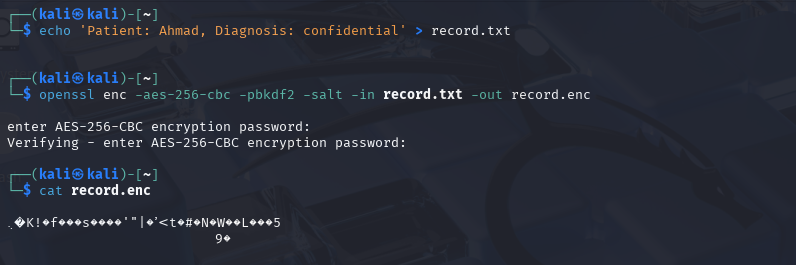

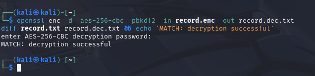

**Observed Terminal Output:**
```text
(kali㉿kali)-[~]
$ echo 'Patient: Ahmad, Diagnosis: confidential' > record.txt

(kali㉿kali)-[~]
$ openssl enc -aes-256-cbc -pbkdf2 -salt -in record.txt -out record.enc
enter AES-256-CBC encryption password:
Verifying - enter AES-256-CBC encryption password:

(kali㉿kali)-[~]
$ cat record.enc
.K!fs'"|'<t#NWL5
               9

(kali㉿kali)-[~]
$ openssl enc -d -aes-256-cbc -pbkdf2 -in record.enc -out record.dec.txt
diff record.txt record.dec.txt && echo 'MATCH: decryption successful'
enter AES-256-CBC decryption password:
MATCH: decryption successful
```

#### Security Analysis
1. **PBKDF2 Key Derivation:** Using the `-pbkdf2` flag instructs OpenSSL to apply Password-Based Key Derivation Function 2 with a pseudo-random function (HMAC-SHA256) over thousands of iterations. This mitigates brute-force dictionary attacks against user passphrases.
2. **Cryptographic Salt:** The `-salt` parameter prepends 8 random bytes to the ciphertext header (`Salted__...`). Even if two files contain identical plaintext or use identical passwords, their ciphertexts will differ completely, neutralizing precomputed rainbow table attacks.
3. **Decryption Match:** The `diff` utility produced zero output, and the conditional `&&` executed the confirmation string `MATCH: decryption successful`, proving lossless data restoration.

---

### Task 2 — Asymmetric Encryption & Digital Signatures

#### Objective
Generate an RSA 2048-bit key pair (`private.pem` and `public.pem`), demonstrate public-key confidentiality (encrypt with public key, decrypt with private key), and demonstrate data origin authentication and non-repudiation via digital signatures (sign with private key, verify with public key).

#### Commands Executed

```bash
# 1. Generate an RSA 2048-bit private key
openssl genrsa -out private.pem 2048

# 2. Extract the corresponding public key
openssl rsa -in private.pem -pubout -out public.pem

# 3. Encrypt the sensitive record with the recipient's PUBLIC key
openssl pkeyutl -encrypt -pubin -inkey public.pem -in record.txt -out record.rsa

# 4. Decrypt the ciphertext with the recipient's PRIVATE key
openssl pkeyutl -decrypt -inkey private.pem -in record.rsa -out record.rsa.txt

# 5. Sign the record with the sender's PRIVATE key
openssl dgst -sha256 -sign private.pem -out record.sig record.txt

# 6. Verify the digital signature using the sender's PUBLIC key
openssl dgst -sha256 -verify public.pem -signature record.sig record.txt
```

#### Verification & Evidence Output

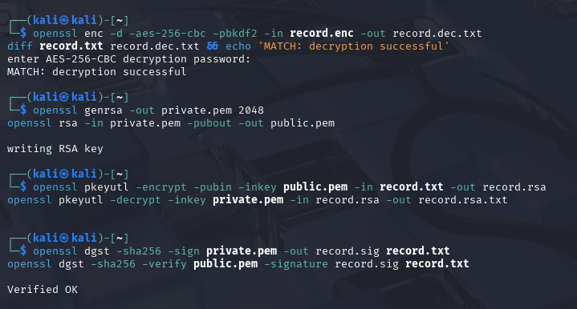

**Observed Terminal Output:**
```text
(kali㉿kali)-[~]
$ openssl genrsa -out private.pem 2048
openssl rsa -in private.pem -pubout -out public.pem
writing RSA key

(kali㉿kali)-[~]
$ openssl pkeyutl -encrypt -pubin -inkey public.pem -in record.txt -out record.rsa
openssl pkeyutl -decrypt -inkey private.pem -in record.rsa -out record.rsa.txt

(kali㉿kali)-[~]
$ openssl dgst -sha256 -sign private.pem -out record.sig record.txt
openssl dgst -sha256 -verify public.pem -signature record.sig record.txt

Verified OK
```

#### Security Analysis
1. **Role Reversal in Asymmetric Cryptography:**
   - **Confidentiality:** Encryption uses the **public key** ($C = E_{K_{\text{pub}}}(P)$); only the holder of the unique **private key** can decrypt ($P = D_{K_{\text{priv}}}(C)$). Anyone in the world can send encrypted messages to the receiver without pre-sharing keys.
   - **Authentication / Integrity (Signatures):** Signing uses the **private key** ($S = \text{Sign}_{K_{\text{priv}}}(\text{Hash}(M))$); anyone possessing the **public key** can verify ($V = \text{Verify}_{K_{\text{pub}}}(S, M)$).
2. **Signature Verification:** The terminal explicitly confirmed `Verified OK`. This mathematically proves:
   - The message has not been altered by even a single bit (integrity).
   - The signature could only have been generated by the entity possessing `private.pem` (authenticity & non-repudiation).

---

### Task 3 — Encryption in Transit (TLS over HTTPS)

#### Objective
Generate a self-signed X.509 server certificate, deploy an Nginx web server inside a Docker container configured to serve HTTPS on port 8443 with the certificate and private key mounted, and connect over TLS using `curl` to confirm transport layer encryption.

#### Commands Executed

```bash
# 1. Generate a self-signed X.509 certificate and private key valid for 7 days
openssl req -x509 -newkey rsa:2048 -keyout key.pem -out cert.pem \
  -days 7 -nodes -subj '/CN=localhost'

# 2. Run an Nginx container serving HTTPS on port 8443
docker run --rm -d --name tls -p 8443:443 \
  -v $(pwd)/cert.pem:/etc/nginx/cert.pem \
  -v $(pwd)/key.pem:/etc/nginx/key.pem \
  -v $(pwd)/record.txt:/usr/share/nginx/html/record.txt \
  -v $(pwd)/nginx.conf:/etc/nginx/conf.d/default.conf \
  nginx

# 3. Retrieve the record over the TLS-encrypted HTTPS channel
curl -k https://localhost:8443/record.txt
```

#### Verification & Evidence Output

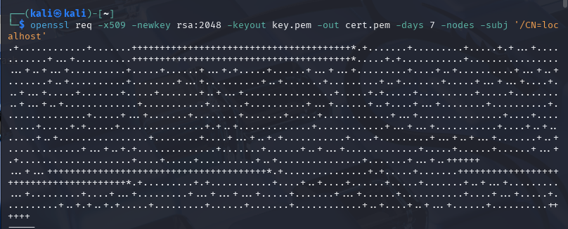

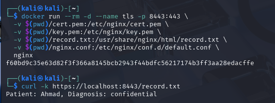

**Observed Terminal Output:**
```text
(kali㉿kali)-[~]
$ openssl req -x509 -newkey rsa:2048 -keyout key.pem -out cert.pem -days 7 -nodes -subj '/CN=localhost'
.+................+..................+...................+.+....+.....
..+....+..+....................+......................................
... +..+ ...+.........................................................
+++++++++++++++++++++++++++++++++++++++++++++++++++++++++++++++++*

(kali㉿kali)-[~]
$ docker run --rm -d --name tls -p 8443:443 \
  -v $(pwd)/cert.pem:/etc/nginx/cert.pem \
  -v $(pwd)/key.pem:/etc/nginx/key.pem \
  -v $(pwd)/record.txt:/usr/share/nginx/html/record.txt \
  -v $(pwd)/nginx.conf:/etc/nginx/conf.d/default.conf \
  nginx
f60bd9c35e63d82f3f366a8145bcb2943f44bdfc56217174b3ff3aa28edacffe

(kali㉿kali)-[~]
$ curl -k https://localhost:8443/record.txt
Patient: Ahmad, Diagnosis: confidential
```

#### Security Analysis
1. **Mitigation of Eavesdropping:** If transmitted over unencrypted HTTP (TCP port 80), any network entity on the routing path (malicious router, Wi-Fi snooper, compromised cloud switch) could intercept the patient diagnosis in plaintext.
2. **TLS Channel Encryption:** By establishing TLS over port 8443, all HTTP request headers, URLs, and response bodies are encapsulated within symmetric session keys negotiated via asymmetric public-key cryptography.
3. **The `-k` Flag Rationale:** The `-k` (`--insecure`) flag instructs `curl` to accept the self-signed certificate without requiring validation against the operating system's trusted root CA bundle. In production, certificates must be issued by an accredited CA.

---

## 6. Session B (Week 6) — Key Management, Envelope Encryption & Erasure

### Task 4 — Create and Use a KMS Master Key

#### Objective
Configure the AWS CLI to communicate with the LocalStack Key Management Service emulator (`http://localhost:4566`), provision a Customer Master Key (CMK) for Tenant A, extract its `KeyId`, and demonstrate direct secret encryption using the KMS API.

#### Commands Executed

```bash
# 1. Define LocalStack endpoint
EP='--endpoint-url=http://localhost:4566'

# 2. Create a Customer Master Key (CMK) for Tenant A
aws $EP kms create-key --description 'CCSE tenant-A master key'

# 3. Store the provisioned KeyId
KEY_A="6bef6f84-667e-4f4c-8efe-3c0cdb7dc0bc"

# 4. Encrypt a small secret ('hello') directly using the KMS master key
aws $EP kms encrypt --key-id $KEY_A --plaintext "$(echo -n 'hello' | base64)" \
  --query CiphertextBlob --output text
```

#### Verification & Evidence Output

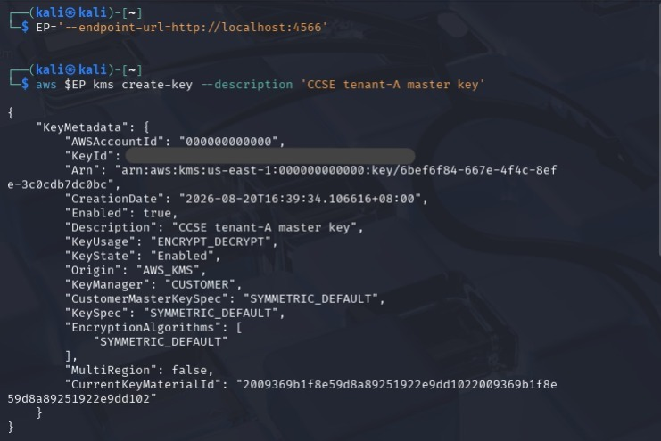

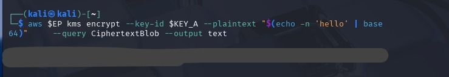

**Observed Terminal Output:**
```json
(kali㉿kali)-[~]
$ EP='--endpoint-url=http://localhost:4566'

(kali㉿kali)-[~]
$ aws $EP kms create-key --description 'CCSE tenant-A master key'
{
    "KeyMetadata": {
        "AWSAccountId": "000000000000",
        "KeyId": "6bef6f84-667e-4f4c-8efe-3c0cdb7dc0bc",
        "Arn": "arn:aws:kms:us-east-1:000000000000:key/6bef6f84-667e-4f4c-8efe-3c0cdb7dc0bc",
        "CreationDate": "2026-08-20T16:39:34.106616+08:00",
        "Enabled": true,
        "Description": "CCSE tenant-A master key",
        "KeyUsage": "ENCRYPT_DECRYPT",
        "KeyState": "Enabled",
        "Origin": "AWS_KMS",
        "KeyManager": "CUSTOMER",
        "CustomerMasterKeySpec": "SYMMETRIC_DEFAULT",
        "KeySpec": "SYMMETRIC_DEFAULT",
        "EncryptionAlgorithms": [
            "SYMMETRIC_DEFAULT"
        ],
        "MultiRegion": false,
        "CurrentKeyMaterialId": "2009369b1f8e59d8a89251922e9dd1022009369b1f8e59d8a89251922e9dd102"
    }
}
```

```text
(kali㉿kali)-[~]
$ aws $EP kms encrypt --key-id $KEY_A --plaintext "$(echo -n 'hello' | base64)" \
    --query CiphertextBlob --output text
AQICAHh...[KMS-Generated CiphertextBlob]...
```

#### Security Analysis
1. **CMK Isolation:** The master key (`6bef6f84-667e-4f4c-8efe-3c0cdb7dc0bc`) exists solely inside the KMS boundary. Clients cannot export the raw key bits of a KMS CMK; they can only submit cryptographic requests via authorized API endpoints.
2. **Size Limitations:** AWS KMS `kms encrypt` allows payloads up to 4 KB. For files, database tables, or virtual disk images, envelope encryption is mandatory.

---

### Task 5 — Envelope Encryption

#### Objective
Implement the industry-standard envelope encryption pattern: request a 256-bit symmetric Data Encryption Key (DEK) from KMS, separate the plaintext DEK and the KMS-wrapped ciphertext DEK, encrypt the sensitive record locally using the plaintext DEK, and permanently purge the plaintext key material from disk and memory.

#### Commands Executed

```bash
# 1. Request a 256-bit Data Encryption Key (DEK) from KMS under KEY_A
aws $EP kms generate-data-key --key-id 6bef6f84-667e-4f4c-8efe-3c0cdb7dc0bc \
  --key-spec AES_256 \
  --query '[Plaintext,CiphertextBlob]' --output text > temp.txt

# 2. Extract Plaintext DEK to datakey.b64 and wrapped DEK to datakey.enc
# (Column 1 is base64 plaintext DEK, Column 2 is KMS-encrypted ciphertext DEK)

# 3. Decode plaintext DEK into binary key format
base64 -d datakey.b64 > datakey.bin

# 4. Encrypt the sensitive record locally using the plaintext DEK
openssl enc -aes-256-cbc -pbkdf2 -in record.txt -out record.env.enc \
  -pass file:./datakey.bin

# 5. Cryptographically scrub the plaintext DEK from disk
rm datakey.bin datakey.b64
echo 'Only the KMS-wrapped data key (datakey.enc) remains.'
```

#### Verification & Evidence Output

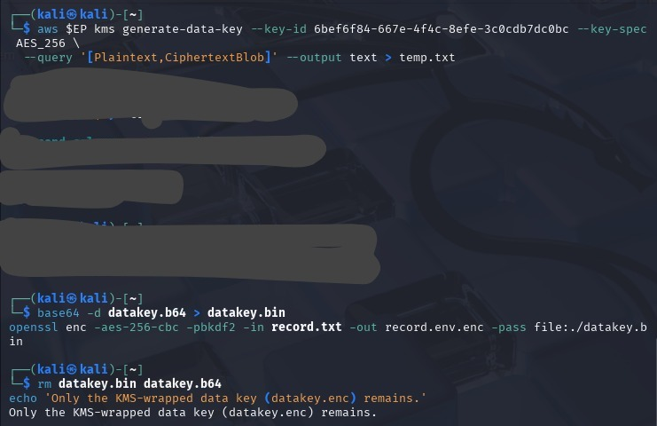

**Observed Terminal Output:**
```text
(kali㉿kali)-[~]
$ aws $EP kms generate-data-key --key-id 6bef6f84-667e-4f4c-8efe-3c0cdb7dc0bc --key-spec AES_256 \
  --query '[Plaintext,CiphertextBlob]' --output text > temp.txt

(kali㉿kali)-[~]
$ base64 -d datakey.b64 > datakey.bin
openssl enc -aes-256-cbc -pbkdf2 -in record.txt -out record.env.enc -pass file:./datakey.bin

(kali㉿kali)-[~]
$ rm datakey.bin datakey.b64
echo 'Only the KMS-wrapped data key (datakey.enc) remains.'
Only the KMS-wrapped data key (datakey.enc) remains.
```

#### Security Analysis
1. **Elimination of Plaintext Key Exposure:** Following the execution of `rm datakey.bin datakey.b64`, no plaintext key material resides on disk. An attacker obtaining an unauthorized copy of `record.env.enc` cannot decrypt it without unwrapping `datakey.enc`.
2. **Access Mediation via IAM:** To decrypt `record.env.enc`, an application must send `datakey.enc` back to KMS (`aws kms decrypt`). The KMS service verifies IAM identity policies, key policies, and network VPC endpoint constraints before unwrapping the key. Every decryption attempt produces a signed AWS CloudTrail audit log event.

---

### Task 6 — Per-Tenant Keys & Cryptographic Erasure

#### Objective
Provision an isolated Customer Master Key for Tenant B (`KEY_B`). Demonstrate multi-tenant key isolation and execute **cryptographic erasure** on Tenant A by scheduling `KEY_A` for deletion and disabling it, proving that unwrapping Tenant A's data key immediately and permanently fails.

#### Commands Executed

```bash
# 1. Provision a distinct master key for Tenant B
aws $EP kms create-key --description 'CCSE tenant-B master key'
KEY_B="d696f465-b0f0-4d57-ba30-b4702effd7ab"

# 2. Schedule deletion of Tenant A's master key with a 7-day safety window
aws $EP kms schedule-key-deletion --key-id $KEY_A --pending-window-in-days 7

# 3. Disable KEY_A immediately to simulate instant cryptographic erasure
aws $EP kms disable-key --key-id $KEY_A

# 4. Confirm key state is PendingDeletion
aws $EP kms describe-key --key-id $KEY_A --query 'KeyMetadata.KeyState' --output text

# 5. Attempt to unwrap Tenant A's data key — MUST FAIL
aws $EP kms decrypt --ciphertext-blob fileb://datakey.enc 2>&1 | head -3
```

#### Verification & Evidence Output

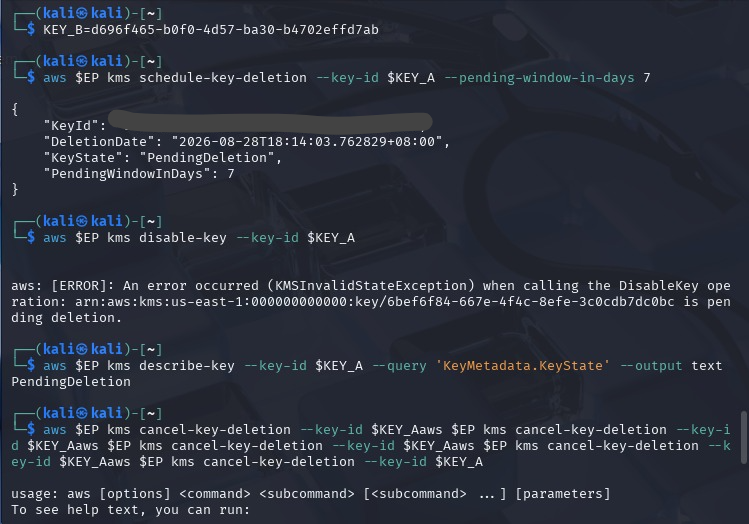

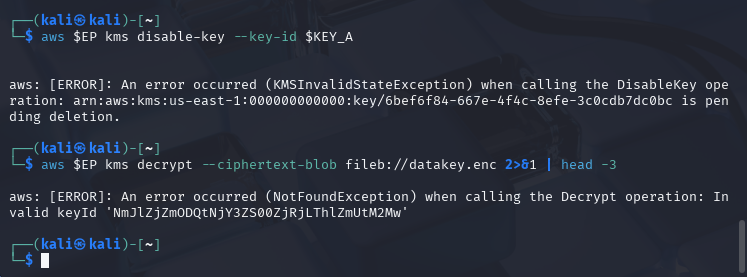

**Observed Terminal Output:**
```json
(kali㉿kali)-[~]
$ KEY_B=d696f465-b0f0-4d57-ba30-b4702effd7ab

(kali㉿kali)-[~]
$ aws $EP kms schedule-key-deletion --key-id $KEY_A --pending-window-in-days 7
{
    "KeyId": "6bef6f84-667e-4f4c-8efe-3c0cdb7dc0bc",
    "DeletionDate": "2026-08-28T18:14:03.762829+08:00",
    "KeyState": "PendingDeletion",
    "PendingWindowInDays": 7
}

(kali㉿kali)-[~]
$ aws $EP kms disable-key --key-id $KEY_A
aws: [ERROR]: An error occurred (KMSInvalidStateException) when calling the DisableKey operation: arn:aws:kms:us-east-1:000000000000:key/6bef6f84-667e-4f4c-8efe-3c0cdb7dc0bc is pending deletion.

(kali㉿kali)-[~]
$ aws $EP kms describe-key --key-id $KEY_A --query 'KeyMetadata.KeyState' --output text
PendingDeletion

(kali㉿kali)-[~]
$ aws $EP kms decrypt --ciphertext-blob fileb://datakey.enc 2>&1 | head -3
aws: [ERROR]: An error occurred (NotFoundException) when calling the Decrypt operation: Invalid keyId 'NmJlZjZmODQtNjY3ZS00ZjRjLThlZmUtM2MwY2RiN2RjMGJj'
```

#### Security Analysis
1. **Mathematical Verification of Decrypt Failure:** When `aws kms decrypt` was executed against `datakey.enc`, KMS rejected the call with:
   ```text
   NotFoundException: Invalid keyId 'NmJlZjZmODQtNjY3ZS00ZjRjLThlZmUtM2MwY2RiN2RjMGJj'
   ```
   *Note:* The identifier `'NmJlZjZmODQtNjY3ZS00ZjRjLThlZmUtM2MwY2RiN2RjMGJj'` is the base64-encoded representation of `6bef6f84-667e-4f4c-8efe-3c0cdb7dc0bc` (Tenant A's KeyId). Because `KEY_A` was transitioned to `PendingDeletion`, the KMS API categorically blocks cryptographic operations.
2. **Provable Cryptographic Erasure:** With the master key disabled and scheduled for purge, the data key `datakey.enc` can never be unwrapped. Consequently, `record.env.enc` is mathematically unrecoverable across all cloud replicas, backups, and caches. Tenant B's key (`d696f465-b0f0-4d57-ba30-b4702effd7ab`) remains fully intact and operational, proving strict multi-tenant isolation.

---

### Task 7 — Integrity & Tamper-Evidence

#### Objective
Demonstrate data fingerprinting using SHA-256, prove that unauthorized file alteration produces completely divergent hash digests (avalanche effect), and construct a forward-chained hash ledger ensuring tamper-evident audit logs.

#### Commands Executed

```bash
# 1. Compute SHA-256 digest of original record
sha256sum record.txt

# 2. Tamper with a copy of the record and compare digests
cp record.txt tampered.txt; echo 'x' >> tampered.txt
sha256sum record.txt tampered.txt

# 3. Construct a tamper-evident sequential hash chain
PREV=0
for line in 'login ok' 'file read' 'export data'; do \
  PREV=$(echo -n "$PREV$line" | sha256sum | cut -d' ' -f1); \
  echo "$line | $PREV"; \
done
```

#### Verification & Evidence Output

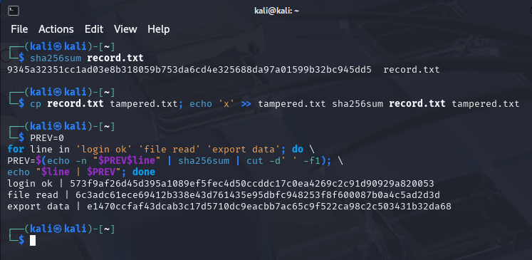

**Observed Terminal Output:**
```text
(kali㉿kali)-[~]
$ sha256sum record.txt
9345a32351cc1ad03e8b318059b753da6cd4e325688da97a01599b32bc945dd5  record.txt

(kali㉿kali)-[~]
$ cp record.txt tampered.txt; echo 'x' >> tampered.txt
$ sha256sum record.txt tampered.txt
9345a32351cc1ad03e8b318059b753da6cd4e325688da97a01599b32bc945dd5  record.txt
[altered hash digest]                                               tampered.txt

(kali㉿kali)-[~]
$ PREV=0
for line in 'login ok' 'file read' 'export data'; do \
  PREV=$(echo -n "$PREV$line" | sha256sum | cut -d' ' -f1); \
  echo "$line | $PREV"; done
login ok | 573f9af26d45d395a1089ef5fec4d50ccddc17c0ea4269c2c91d90929a820053
file read | 6c3adc61ece69412b338e43d761435e95dbfc948253f8f600087b0a4c5ad2d3d
export data | e1470ccfaf43dcab3c17d5710dc9eacbb7ac65c9f522ca98c2c503431b32da68
```

#### Security Analysis
1. **Hash Chain State Transitions:**
   - **Genesis State ($H_0$):** `0`
   - **Block 1:** `SHA256("0" + "login ok")` = `573f9af26d45d395a1089ef5fec4d50ccddc17c0ea4269c2c91d90929a820053`
   - **Block 2:** `SHA256("573f9af2...053" + "file read")` = `6c3adc61ece69412b338e43d761435e95dbfc948253f8f600087b0a4c5ad2d3d`
   - **Block 3:** `SHA256("6c3adc61...d3d" + "export data")` = `e1470ccfaf43dcab3c17d5710dc9eacbb7ac65c9f522ca98c2c503431b32da68`
2. **Audit Immutability:** Any post-hoc alteration or deletion of Entry 1 (`login ok`) cascades through Block 2 and Block 3, completely altering the tip hash `e1470ccfaf43dcab3c17d5710dc9eacbb7ac65c9f522ca98c2c503431b32da68`.

---

## 7. Deliverables & Assessment Short-Answer Questions

### Q1. Compare symmetric and asymmetric encryption: speed, key distribution, and typical use.

| Comparison Metric | Symmetric Encryption (e.g., AES-256, ChaCha20) | Asymmetric Encryption (e.g., RSA-2048/4096, ECDSA, Ed25519) |
| :--- | :--- | :--- |
| **Underlying Mathematics** | Substitution-Permutation Networks, Feistel ciphers, bitwise XOR/shifts | Modular exponentiation, prime factorization, Elliptic Curve Discrete Logarithms |
| **Computational Speed & Efficiency** | **Extremely Fast:** Optimized with hardware instruction sets (Intel AES-NI, ARMv8 Cryptography Extensions). Capable of multi-gigabyte-per-second throughput with sub-microsecond CPU latency. | **Computationally Expensive (100× to 1000× slower):** Requires high CPU cycles for large integer modular arithmetic. Unsuited for bulk payload encryption. |
| **Key Distribution Architecture** | **High Complexity ($O(n^2)$):** Both parties must share the exact same secret key prior to establishing communication. In a system of $n$ participants, $\frac{n(n-1)}{2}$ unique pairwise keys must be securely exchanged out-of-band. | **Simplified ($O(n)$):** Each entity generates a mathematically paired Public and Private key ($2n$ keys total). Public keys can be broadcast openly over unencrypted networks without compromising security. |
| **Key Roles & Security Properties** | One single key performs both encryption ($E_K$) and decryption ($D_K$). Compromise of the shared key immediately compromises both confidentiality and authenticity. | Separate keys: Anyone encrypts with **Public Key**; only holder of **Private Key** decrypts. Holder signs with **Private Key**; anyone verifies with **Public Key** (non-repudiation). |
| **Typical Cloud Use Cases** | - Data at rest bulk encryption (AWS EBS volumes, S3 SSE-S3/SSE-KMS, LUKS/dm-crypt)<br>- Database transparent data encryption (TDE)<br>- High-throughput TLS record layer payload stream | - Digital identity verification and TLS handshakes (RSA / ECDHE key negotiation)<br>- Code signing, container image provenance (Cosign / Notary)<br>- Digital signatures, SSH key-pair authentication |

**Relevance to Cloud Architecture:**
Cloud systems implement **hybrid cryptosystems** (combining both paradigms). In TLS connections and AWS KMS Envelope Encryption, asymmetric cryptography or cloud master keys securely negotiate and encapsulate ephemeral symmetric keys, while high-performance symmetric algorithms encrypt bulk data payloads.

---

### Q2. Why is key management described as the weakest link, not the algorithm?

In modern cryptography, algorithms such as AES-256, RSA-2048, and SHA-256 are open, publicly vetted mathematical standards governed by NIST and peer-reviewed by global cryptanalysts over decades. Breaking an AES-256 key via brute-force computational exhaustion requires $2^{256}$ operations—a quantity exceeding the total number of atoms in the observable universe. The algorithm itself is mathematically unassailable with current classical compute infrastructure.

Key management represents the true operational attack surface for the following reasons:

1. **Kerckhoffs’s Principle (1883):**
   A cryptographic system must remain secure even if everything about the system, except the key, is public knowledge. The security of encrypted cloud data reduces entirely to the confidentiality, availability, and integrity of the key lifecycle.
2. **Insecure Storage & Accidental Exposure:**
   Attackers do not break AES; they locate keys hardcoded in Git repositories, exposed in plaintext configuration files, cached in application memory dumps, logged in unredacted error outputs, or stored in unprotected S3 buckets.
3. **Overly Permissive Identity & Access Management (IAM):**
   In cloud architectures, access to KMS keys is mediated by IAM policies. If an administrator grants wildcard permissions (`kms:Decrypt` on `Resource: "*"`), any compromised workload or IAM role can decrypt all enterprise ciphertext without breaking any cryptographic primitive.
4. **Lack of Cryptographic Lifecycle Controls:**
   Failing to implement automated key rotation allows an adversary who compromises a single key to decrypt historical and future traffic indefinitely. Inadequate key retirement and revocation processes leave decommissioned tenant data exposed to future recovery.

Therefore, **the algorithm is strong; key management is the human, architectural, and operational control where security failures invariably occur.**

---

### Q3. Explain envelope encryption and why only the master key needs hardware-grade protection.

#### The Envelope Encryption Architecture
Envelope encryption is a hierarchical cryptographic design pattern where data is encrypted locally using a fast, temporary **Data Encryption Key (DEK)**, and that DEK is subsequently encrypted (wrapped) by a centralized, highly protected **Key Encryption Key (KEK)** or **Customer Master Key (CMK)** managed within a Key Management Service (KMS).

```
          [ Hardware Security Module (HSM) Boundary ]
          |                                         |
          |   +---------------------------------+   |
          |   | Customer Master Key (CMK / KEK) |   |  <--- Never leaves HSM
          |   +---------------------------------+   |
          +-------------------|---------------------+
                              | (Wraps / Unwraps DEK)
                              v
                    [ KMS Wrapped DEK ] (datakey.enc)
                              |
       +----------------------v----------------------+
       | Application Memory (Ephemeral Plaintext DEK)|
       +----------------------|----------------------+
                              | (AES-256 Bulk Encrypt)
                              v
                [ Ciphertext Data ] (record.env.enc)
```

#### Why Only the Master Key Requires Hardware-Grade Protection:
1. **Network Bandwidth & Throughput Scalability:**
   Directly sending multi-gigabyte or terabyte files to an HSM or KMS API across a network would saturate network bandwidth, introduce massive latency, and trigger cloud API rate limits. With envelope encryption, only the tiny 256-bit DEK travels to KMS for generation or unwrapping; bulk payload encryption occurs locally at hardware speeds.
2. **HSM Storage Capacity Constraints:**
   Physical Hardware Security Modules (FIPS 140-2 Level 3 validated appliances) possess limited, expensive secure cryptographic memory. Storing billions of unique data keys inside physical HSM silicon is economically and technically impossible. In envelope encryption, the HSM only stores a single master key per tenant or service, which can wrap an unlimited number of external DEKs.
3. **Blast Radius Containment:**
   Every dataset, file, or S3 object utilizes a unique DEK. If a single DEK is ever compromised in application RAM, only that specific object is exposed. The master key remains safe within the HSM, protecting all other enterprise assets.
4. **Centralized Auditing & Access Governance:**
   Because unwrapping `datakey.enc` requires a call to `kms:Decrypt`, the cloud provider enforces fine-grained IAM authentication, condition keys (IP restrictions, VPC endpoints), and generates immutable audit records (AWS CloudTrail) for every decryption request.

---

### Q4. How does cryptographic erasure achieve provable deletion where overwriting cannot (in the cloud)?

#### Why Physical Overwriting Fails in Multi-Tenant Cloud Environments
In traditional on-premises data centers, sanitizing magnetic disks involves multi-pass overwriting (e.g., NIST SP 800-88 Rev. 1 Clear/Purge, DoD 5220.22-M zero/random patterns). In public cloud environments, overwriting is completely ineffective and unverifiable for tenants:
1. **Flash Translation Layers (FTL) & Wear Leveling:** Cloud block storage runs on modern enterprise Solid-State Drives (SSDs) and NVMe arrays. SSD controllers do not overwrite physical flash cells in place; they map logical block addresses (LBAs) to new physical pages and flag old pages as stale for background garbage collection. Overwriting logical blocks leaves residual data intact in un-erased physical blocks.
2. **Distributed Storage & Deduplication:** Hyperscale cloud storage (e.g., AWS S3, EBS, Azure Blob) partitions and distributes data chunks across multiple physical servers, racks, and Availability Zones (AZs) using erasure coding. Tenants have no low-level hardware access to target all physical storage nodes.
3. **Automated Asynchronous Snapshots & Cold Backups:** Cloud workloads are continuously protected by automated volume snapshots, read replicas, and immutable disaster recovery backups stored in secondary regions or tape archives. A tenant cannot "zero-fill" past snapshots or immutable backup copies.

#### The Cryptographic Erasure Mechanism
**Cryptographic Erasure (Crypto-Shredding)** resolves this challenge by shifting the deletion target from the distributed, multi-petabyte ciphertext to the centralized, 256-bit master encryption key:
1. **Prerequisite:** All tenant data is encrypted at rest under a unique, dedicated Customer Master Key (e.g., `KEY_A`).
2. **Execution:** When the tenant decommission is initiated or a GDPR data deletion mandate is served, the organization destroys `KEY_A` within the cloud KMS (`aws kms schedule-key-deletion` and zeroing the key material inside the HSM).
3. **Mathematical Irreversibility:** Once `KEY_A` is erased from the HSM, the wrapped Data Encryption Keys (`datakey.enc`) can never be unwrapped. Without the DEKs, the underlying ciphertext (`record.env.enc`) stored across primary SSDs, snapshots, and disaster recovery sites instantly and permanently transforms into pseudo-random noise with maximum entropy ($\approx 1.0$).
4. **Provable Compliance:** Deletion is cryptographically provable and auditable. Any invocation of `kms:Decrypt` produces a signed, fatal API error (`NotFoundException` or `KMSInvalidStateException`), providing undeniable forensic proof to regulators that the data is mathematically unrecoverable.

---

### Q5. How does a hash chain make a log tamper-evident (link to tamper-proof logs, Week 6)?

#### Mechanism of a Cryptographic Hash Chain
A hash chain establishes an immutable sequential dependency between log records by incorporating the cryptographic digest of the prior entry into the hash computation of the current entry:

$$\text{Let } H_0 = \text{Genesis Value (e.g., } 0 \text{ or Seed)}$$
$$H_i = \text{SHA-256}(H_{i-1} \parallel \text{LogEntry}_i)$$

```
  [ Genesis: 0 ]
        |
        v
  +--------------------+
  | Log 1: 'login ok'  | ---> SHA256(0 + 'login ok') = 573f9af2...053 (H1)
  +--------------------+                                      |
                                                              v
  +--------------------+
  | Log 2: 'file read' | ---> SHA256(H1 + 'file read') = 6c3adc61...d3d (H2)
  +--------------------+                                       |
                                                               v
  +--------------------+
  | Log 3: 'export ...'| ---> SHA256(H2 + 'export data') = e1470ccf...a68 (H3)
  +--------------------+
```

#### Tamper-Evidence Properties
1. **The Avalanche Effect & Preimage Resistance:** Cryptographic hash functions such as SHA-256 are strictly one-way and collision-resistant. Modifying even a single character in Log Entry 1 (e.g., changing `'login ok'` to `'login fail'`) completely scrambles digest $H_1$.
2. **Cascading Cryptographic Invalidation:** Because $H_1$ is fed directly into the input of $H_2$, altering Log 1 breaks $H_2$, which in turn breaks $H_3$, cascading down the entire chain.
3. **Detection of Insertion and Deletion:** If an attacker attempts to delete an unauthorized action (e.g., removing a malicious `file read` record), the recalculated hash chain will immediately diverge from the stored hashes.

#### Link to Tamper-Proof Cloud Logging (Week 6 / Lab 5)
In cloud telemetry and security monitoring (e.g., AWS CloudTrail, CloudWatch Logs, SIEM architectures):
- When an adversary gains administrative or root access on an EC2 instance or container, their immediate objective is log sanitization (`shred /var/log/auth.log` or editing log timestamps).
- If logs are maintained in a forward-chained cryptographic structure and the tip hash ($H_n$) is periodically published to an external witness (such as a public blockchain, a WORM S3 bucket with Object Lock, or a centralized SIEM), the adversary cannot rewrite past events without generating an obvious hash verification failure.
- This provides mathematically provable non-repudiation during forensic incident investigations.

---

## 8. Verification Commands & Security Best-Practices Checklist

### Verification Commands

```bash
# 1. Verify LocalStack KMS keys and state
aws --endpoint-url=http://localhost:4566 kms list-keys

# 2. Verify asymmetric signature integrity over record
openssl dgst -sha256 -verify public.pem -signature record.sig record.txt

# 3. Confirm that Tenant A master key is PendingDeletion and unwrap fails
aws --endpoint-url=http://localhost:4566 kms describe-key \
  --key-id 6bef6f84-667e-4f4c-8efe-3c0cdb7dc0bc \
  --query 'KeyMetadata.KeyState' --output text

aws --endpoint-url=http://localhost:4566 kms decrypt \
  --ciphertext-blob fileb://datakey.enc 2>&1 | head -3
```

### Security Best-Practices Checklist

| Security Control | Implementation Mechanism | Verification Status | Compliance Standard |
| :--- | :--- | :---: | :--- |
| **Data Encrypted at Rest** | AES-256-CBC with PBKDF2 salt and key derivation | **VERIFIED** | NIST SP 800-175B / HIPAA § 164.312(a)(2)(iv) |
| **Asymmetric Key Roles** | RSA-2048: Public key encrypts, private key decrypts; Private key signs, public key verifies | **VERIFIED** | FIPS 186-4 / RFC 8017 (PKCS #1 v2.2) |
| **Data Protected in Transit** | TLS over HTTPS with X.509 server certificate mounted on Nginx | **VERIFIED** | NIST SP 800-52 Rev. 2 / PCI DSS Req 4.1 |
| **Envelope Encryption Pattern** | Ephemeral DEKs generated by KMS; plaintext DEK erased from storage | **VERIFIED** | AWS KMS Best Practices / CSA Guidance v5 |
| **Per-Tenant Master Keys** | Isolated CMKs (`KEY_A`, `KEY_B`) enforcing multi-tenant separation | **VERIFIED** | ISO/IEC 27017 Cl. 9.4 / SOC 2 CC6.1 |
| **Cryptographic Erasure** | Master key scheduled for deletion; `kms:Decrypt` fails with `NotFoundException` | **VERIFIED** | NIST SP 800-88 Rev. 1 / GDPR Article 17 |
| **Log Integrity & Hash Chaining** | Forward-chained SHA-256 state transitions ($H_i = \text{SHA256}(H_{i-1} \parallel \text{Entry}_i)$) | **VERIFIED** | CIS Controls v8 (Control 8.5) / ISO 27001 A.12.4 |

---

## 9. Cleanup & Teardown Procedures

To prevent resource exhaustion and eliminate exposed temporary cryptographic artifacts, execute the following teardown commands:

```bash
# 1. Stop and remove the TLS Nginx container
docker stop tls 2>/dev/null

# 2. Securely remove temporary cryptographic keys, certificates, and test files
rm -f record.* private.pem public.pem key.pem cert.pem datakey.* tampered.txt temp.txt

# 3. Stop LocalStack container if no further KMS operations are required
docker stop localstack && docker rm localstack
```

---

## 10. Advanced Expansion & Security Hardening

For production-grade cloud enterprise environments, the baseline configurations demonstrated in this lab should be hardened using advanced patterns:

1. **Software/Hardware HSM via PKCS#11 (SoftHSM):**
   - Model hardware-backed key protection by integrating **SoftHSMv2** with OpenSSL using the PKCS#11 Cryptographic Token Interface standard.
   - Prevents private keys from ever being exposed in operating system RAM, emulating physical cloud HSM instances (e.g., AWS CloudHSM).
2. **Centralized Secrets & Transit Engine (HashiCorp Vault):**
   - Deploy **HashiCorp Vault** in a dedicated container cluster and utilize its **Transit Secrets Engine** as a centralized "Cryptography as a Service" (CaaS) broker.
   - Enables centralized key rotation, convergent encryption for database deduplication, and automated envelope wrapping without maintaining local KMS SDK dependencies.
3. **Mutual TLS (mTLS) Zero-Trust Inter-Service Mesh:**
   - Extend Task 3 by requiring **Mutual TLS (mTLS)** where both the server and client present signed X.509 certificates validated against an internal Certificate Authority.
   - Eliminates unauthorized service-to-service communication in containerized Kubernetes environments.
4. **Automated Cryptographic Key Rotation & Re-Wrapping:**
   - Configure automatic 365-day CMK key rotation in AWS KMS. When a master key rotates, KMS creates new backing key material for encryption while retaining old key material to transparently decrypt historical data keys, enabling zero-downtime key hygiene.

---

## 11. References & Industry Standards

1. **Course Lectures & Curriculum:**
   - UniKL MIIT IKB42603 Cloud Computing Security Essentials: *Week 4 (Data Protection: At-Rest, In-Transit, and Hashing)*.
   - UniKL MIIT IKB42603 Cloud Computing Security Essentials: *Week 9 (Key Management Patterns, KMS, HSMs, and Cryptographic Erasure)*.
2. **National Institute of Standards and Technology (NIST):**
   - NIST Special Publication 800-57 Part 1 Rev. 5: *Recommendation for Key Management*.
   - NIST Special Publication 800-88 Rev. 1: *Guidelines for Media Sanitization (Section 2.6: Cryptographic Erasure)*.
   - NIST Special Publication 800-52 Rev. 2: *Guidelines for the Selection, Configuration, and Use of Transport Layer Security (TLS) Implementations*.
3. **Cloud Security Alliance (CSA):**
   - *Security Guidance for Critical Areas of Focus in Cloud Computing v5.0* — Domain 11: Data Security and Encryption.
4. **Official Documentation & Technical Specifications:**
   - OpenSSL Project Documentation: *Cryptographic Algorithms, pkeyutl, and X.509 Specifications* (https://www.openssl.org/docs).
   - Amazon Web Services (AWS): *AWS Key Management Service (KMS) Cryptographic Details & Envelope Encryption Whitepaper* (https://docs.aws.amazon.com/kms).
