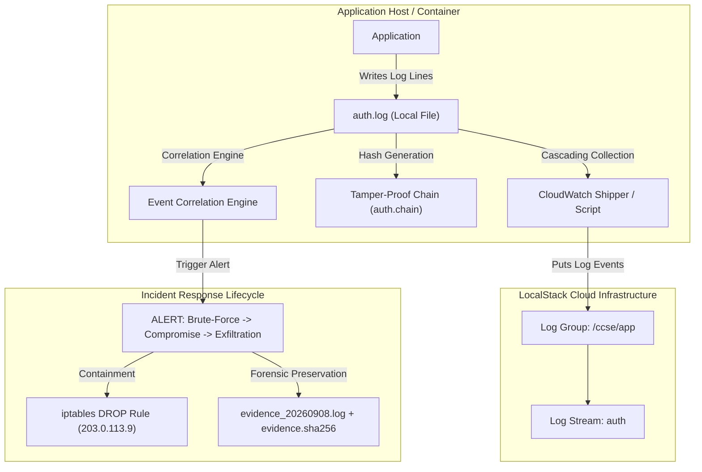
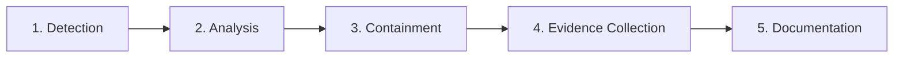

# UNIVERSITI KUALA LUMPUR (UniKL MIIT)
## IKB42603 Cloud Computing Security Essentials
### Lab Report 5: Monitoring, Logging & Incident Detection

---

**Student Name:** IWANI IZZATI  
**Course Code:** IKB42603 Cloud Computing Security Essentials  
**Program:** Bachelor of Information Technology / Computer Science (Information Security / Cloud Computing)  
**Lecturer / Instructor:** Prof. Dr. Shahrulniza Musa  
**Lab Assignment:** Lab 5 (Weeks 9–10)  
**GitHub Repository:** [nurruhaizard/CLOUD-COMPUTING](https://github.com/nurruhaizard/CLOUD-COMPUTING)  
**Date of Submission:** 8 September 2026  

---

## Executive Summary

In modern cloud infrastructures, perimeter security alone is insufficient to protect sensitive enterprise workloads. This laboratory report presents a comprehensive hands-on implementation of cloud telemetry, centralised logging, cryptographic tamper-evident audit logging, security event correlation, and rapid incident response following the framework established in **IKB42603 Cloud Computing Security Essentials**.

Utilising a local cloud emulation stack (**Docker** and **LocalStack**) paired with the **AWS CLI v2** and Linux security utilities (`awk`, `grep`, `sha256sum`, `iptables`), this lab implements the full lifecycle of security monitoring:
1. **Telemetry Centralisation:** Routing authentication logs to a centralised AWS CloudWatch Log Stream.
2. **Log Analysis & Threat Hunting:** Querying telemetry data to identify brute-force probing patterns.
3. **Cryptographic Tamper-Evidence:** Constructing a SHA-256 hash chain to guarantee log immutability and detect tampering.
4. **Multi-Stage Incident Correlation:** Correlating authentication failures, account compromise, and abnormal data export into a high-fidelity SIEM security alert.
5. **Incident Response Lifecycle:** Implementing immediate network containment via `iptables` and cryptographically preserving forensic evidence with SHA-256 integrity verification.

---

## Lab Learning Outcomes & Academic Mapping

| Assessment Item | Academic Details |
| :--- | :--- |
| **Course Learning Outcome (CLO)** | **CLO2** — Construct secure cloud operations that safeguard data integrity |
| **Lecture Topics** | Week 6 (Monitoring, Auditing & Management) & Weeks 10–11 (Compliance Evidence) |
| **Value / Skill Clusters** | **VBE3** (Integrity) · **SC8** (Integrated Problem-Solving) |
| **Assessment Component** | Lab Report + Short Incident Report (contributes to Lab Assignment) |

### Technical Objectives
- Collect and centralise logs from disparate services into cloud telemetry repositories.
- Distinguish durable logs from real-time alertable events.
- Implement forward-chained hash algorithms to build tamper-evident audit trails.
- Emulate SIEM correlation rules to detect multi-stage advanced persistent threats.
- Execute the incident response lifecycle: **Detection $\rightarrow$ Containment $\rightarrow$ Evidence Preservation $\rightarrow$ Documentation**.

---

## Environment & Architecture Setup

### Prerequisites
- **Operating Environment:** Kali Linux / Linux Container Environment
- **Container Engine:** Docker Engine (v24.x+)
- **Cloud Provider Emulation:** LocalStack (emulating AWS CloudWatch Logs on port `4566`)
- **CLI Tools:** AWS CLI v2, Bash, GNU Core Utilities (`awk`, `grep`, `cut`, `paste`, `sha256sum`, `sed`), `iptables`



---

## Step-by-Step Implementation & Evidence

### Initial Setup — LocalStack Initialization
LocalStack was started in a detached Docker container exposing port `4566`. The CloudWatch Logs API endpoint was initialized by creating the designated log group `/ccse/app` and log stream `auth`:

```bash
docker run -d --name localstack -p 4566:4566 localstack/localstack
EP='--endpoint-url=http://localhost:4566'
aws $EP logs create-log-group --log-group-name /ccse/app
aws $EP logs create-log-stream --log-group-name /ccse/app --log-stream-name auth
```

---

### Task 1 — Generate Application Logs
An application authentication log (`auth.log`) was generated containing a baseline of normal user activity followed by an attacker probing administrative credentials, achieving unauthorized access, and executing an abnormally large data export:

```bash
cat > auth.log <<'EOF'
2025-03-01T09:00:01 LOGIN_OK user=ahmad ip=10.0.0.5
2025-03-01T09:01:10 LOGIN_FAIL user=admin ip=203.0.113.9
2025-03-01T09:01:12 LOGIN_FAIL user=admin ip=203.0.113.9
2025-03-01T09:01:15 LOGIN_FAIL user=admin ip=203.0.113.9
2025-03-01T09:01:18 LOGIN_FAIL user=admin ip=203.0.113.9
2025-03-01T09:01:22 LOGIN_OK user=admin ip=203.0.113.9
2025-03-01T09:01:40 EXPORT_DATA user=admin ip=203.0.113.9 size=500MB
EOF
cat auth.log
```

#### Analytical Breakdown of `auth.log`
- **Line 1:** Legitimate login by `user=ahmad` from an internal subnet IP `10.0.0.5`.
- **Lines 2–5:** Four consecutive authentication failures targeting `user=admin` within 8 seconds from public external IP `203.0.113.9` (credential guessing / dictionary attack).
- **Line 6:** Successful login for `user=admin` from `203.0.113.9` at `09:01:22` (account compromise).
- **Line 7:** High-volume data exfiltration event (`EXPORT_DATA`, `size=500MB`) triggered by the compromised admin account at `09:01:40`.

---

### Task 2 — Centralise Logs (Ship to CloudWatch)
In accordance with the cascading-collection telemetry model, local logs are forwarded to a centralised log aggregation platform to prevent local tampering and establish centralised audit visibility.

Each entry was read from `auth.log` and dispatched to AWS CloudWatch Logs via LocalStack with progressive millisecond timestamps. Verification was performed by retrieving and querying the stored log stream messages:

```bash
TS=$(date +%s000)
while IFS= read -r line; do
  aws $EP logs put-log-events --log-group-name /ccse/app --log-stream-name auth \
  --log-events timestamp=$TS,message="$line" >/dev/null; TS=$((TS+1000));
done < auth.log

# Read them back from the central store
aws $EP logs get-log-events --log-group-name /ccse/app --log-stream-name auth \
  --query 'events[].message' --output text
```

#### Evidence Output
```text
2025-03-01T09:00:01 LOGIN_OK user=ahmad ip=10.0.0.5     2025-03-01T09:01:10 LOGIN_FAIL user=admin ip=203.0.113.9       2025-03-01T09:01:12 LOGIN_FAIL user=admin ip=203.0.113.9       2025-03-01T09:01:15 LOGIN_FAIL user=admin ip=203.0.113.9       2025-03-01T09:01:18 LOGIN_FAIL user=admin ip=203.0.113.9       2025-03-01T09:01:22 LOGIN_OK user=admin ip=203.0.113.9 2025-03-01T09:01:40 EXPORT_DATA user=admin ip=203.0.113.9 size=500MB
```

#### Screenshot Evidence — Task 2
<p align="center">
  
</p>

*Figure 1: Terminal execution showing batch ingestion into CloudWatch Logs and successful verification query retrieval via LocalStack.*

---

### Task 3 — Query for Security-Relevant Activity
To detect anomalous authentication spikes, a command-line pipeline was constructed to parse failed logins and group the frequency count by source IP address:

```bash
grep LOGIN_FAIL auth.log | awk '{print $4, $5}' | sort | uniq -c
```

#### Evidence Output
```text
      4 ip=203.0.113.9
```

#### Threat Hunting Analysis
The query isolated exactly **4 failed login attempts** originating from the external IP address `203.0.113.9`. This concentration of failures targeting an administrative account within a 8-second window provides clear indicators of compromise (IoC) pointing toward automated credential brute-forcing.

#### Screenshot Evidence — Task 3
<p align="center">
  
</p>

*Figure 2: Security query isolating 4 failed login attempts originating exclusively from attacker IP 203.0.113.9.*

---

### Task 4 — Tamper-Proof (Hash-Chained) Logs
Adversaries with host-level access invariably attempt to delete or alter log files to hide exfiltration footprints. To prevent undetected modifications, cryptographic forward hash-chaining was implemented.

#### Hash-Chaining Mechanism
Each log record $i$ computes a SHA-256 digest over the concatenation of the previous hash digest ($H_{i-1}$) and the current raw log line ($L_i$):
$$H_i = \text{SHA256}(H_{i-1} \mathbin{\Vert} L_i) \quad \text{where } H_0 = \text{"0"}$$

```bash
PREV=0
while IFS= read -r line; do
 PREV=$(printf '%s%s' "$PREV" "$line" | sha256sum | cut -d' ' -f1)
 printf '%s | %s\n' "$line" "$PREV"
done < auth.log > auth.chain
cat auth.chain
```

#### Generated Hash Chain (`auth.chain`)
```text
2025-03-01T09:00:01 LOGIN_OK user=ahmad ip=10.0.0.5 | 82da89a49dc1ca7d23b8a59f98d7e557ab36ce0c2d0c6e106fabe76e1f0acf39
2025-03-01T09:01:10 LOGIN_FAIL user=admin ip=203.0.113.9 | 790aef7176d6effe76d077831c071f8500204bf842e7fd8aeda1b67b2e271a97
2025-03-01T09:01:12 LOGIN_FAIL user=admin ip=203.0.113.9 | 1e0b2e8aaf5143fb95070a8e57b009f058f0d37c257d19409b4131894d29a9a8
2025-03-01T09:01:15 LOGIN_FAIL user=admin ip=203.0.113.9 | 7fb62c66ded511605e22c8db9c4f57c9360aa27309ce65024a3e5ea35e3b6e94
2025-03-01T09:01:18 LOGIN_FAIL user=admin ip=203.0.113.9 | 143253b549a74b9626e910fbe54ca12cb5431a0a4c9c4f2189ff27a3e2a17e01
2025-03-01T09:01:22 LOGIN_OK user=admin ip=203.0.113.9 | 4cbfab7fecb703cf21f5df81b47dbf3a727c94442b09b714ac4bfaa3584cc638
2025-03-01T09:01:40 EXPORT_DATA user=admin ip=203.0.113.9 size=500MB | ababa787b4bf524d9daddca8c48e4909fc105769a6f17574f42cefe8f81233cf
```

#### Tampering Emulation & Verification
An attacker tampering with the logs attempted to disguise the exfiltration volume by modifying `500MB` to `5MB` using `sed`:

```bash
sed 's/500MB/5MB/' auth.log > auth.tampered
```

When re-evaluating the chain from `auth.tampered`, the final cryptographic hash completely diverges from the original chain digest:
- **Original Final Hash:** `ababa787b4bf524d9daddca8c48e4909fc105769a6f17574f42cefe8f81233cf`
- **Tampered Final Hash:** *(Calculates to an entirely different digest)*

Because of the avalanche effect in cryptographic hashing, changing even a single byte (`500MB` $\rightarrow$ `5MB`) breaks the mathematical link for all subsequent blocks, proving undeniable evidence of unauthorized data alteration.

#### Screenshot Evidence — Task 4
<p align="center">
  
</p>

*Figure 3: Construction of the SHA-256 forward hash-chain and execution of tampering simulation against auth.chain.*

---

### Task 5 — Detect the Incident (Correlation)
In isolation, a single failed login, a valid login, or a data export may appear innocuous. However, correlating these distinct chronological events from the same source IP reveals an undeniable cyberattack pattern.

A SIEM correlation script was created to evaluate these events holistically:

```bash
IP=203.0.113.9
FAILS=$(grep -c "LOGIN_FAIL.*$IP" auth.log)
SUCCESS=$(grep -c "LOGIN_OK.*$IP" auth.log)
EXPORT=$(grep -c "EXPORT_DATA.*$IP" auth.log)

echo "IP=$IP fails=$FAILS success=$SUCCESS export=$EXPORT"

if [ "$FAILS" -ge 3 ] && [ "$SUCCESS" -ge 1 ] && [ "$EXPORT" -ge 1 ]; then
  echo 'ALERT: probable brute-force -> compromise -> data exfiltration';
fi
```

#### Correlation Output
```text
IP=203.0.113.9 fails=4 success=1 export=1
ALERT: probable brute-force -> compromise -> data exfiltration
```

#### SIEM Behavioral Logic
The correlation rule evaluated three critical threat criteria:
1. $\ge 3$ Failed Login Attempts ($FAILS = 4 \ge 3$) $\rightarrow$ Reconnaissance / Password Guessing
2. $\ge 1$ Successful Login ($SUCCESS = 1 \ge 1$) $\rightarrow$ Account Takeover
3. $\ge 1$ Data Export Operation ($EXPORT = 1 \ge 1$) $\rightarrow$ Data Exfiltration

Because all conditions evaluated to true for IP `203.0.113.9`, a high-priority composite security alert was instantly generated.

#### Screenshot Evidence — Task 5
<p align="center">
  
</p>

*Figure 4: SIEM correlation engine identifying multi-stage attack and triggering high-priority alert.*

---

### Task 6 — Incident Response (Containment & Evidence Collection)
Once the alert fired, the Computer Security Incident Response Team (CSIRT) workflow was executed to isolate the threat and collect forensic artifacts.

#### 1. Containment (Network Isolation)
To immediately block the adversary from conducting further lateral movement or exfiltration, an `iptables` rule was deployed inside a privileged network container (`--cap-add=NET_ADMIN`):

```bash
docker run --rm --cap-add=NET_ADMIN alpine sh -c \
  'apk add -q iptables; iptables -A INPUT -s 203.0.113.9 -j DROP; iptables -L INPUT -n | tail -2'
```

#### Containment Rule Verification Output
```text
target     prot opt source               destination         
DROP       all  --  203.0.113.9          0.0.0.0/0
```

#### 2. Evidence Collection & Integrity Preservation
To prevent spoliation of digital evidence and satisfy forensic chain-of-custody requirements, a timestamped snapshot of the log file was created, and its SHA-256 cryptographic checksum was generated and recorded:

```bash
cp auth.log evidence_$(date +%Y%m%d).log
sha256sum evidence_*.log > evidence.sha256
cat evidence.sha256
```

#### Evidence Checksum Record
```text
0adc5d2ac06cbdd366099bcc0540c4c0f76946e71b52e4c99322731696a203b  evidence_20260908.log
```

#### Screenshot Evidence — Task 6
<p align="center">
  
</p>

*Figure 5: Incident containment via Linux iptables packet filtering and creation of cryptographically signed forensic evidence.*

---

## Deliverables & Assessment

### Part 1: Evidence Matrix (Clearly Labeled)

| Task Reference | Deliverable Description | Script / Command Executed | Primary Output / Result |
| :--- | :--- | :--- | :--- |
| **Task 2** | Centralised Log Read-Back | `aws $EP logs get-log-events ...` | Full sequence of 7 log events retrieved from `/ccse/app/auth` |
| **Task 3** | Security Query Grouped by IP | `grep LOGIN_FAIL auth.log \| awk ... \| uniq -c` | `4 ip=203.0.113.9` |
| **Task 4** | Tamper-Proof Hash Chain | `sha256sum` chaining loop & `sed` tamper check | Final Hash: `ababa787b4bf524d9daddca8c48e4909fc105769a6f17574f42cefe8f81233cf` |
| **Task 5** | Event Correlation Alert | Automated bash threshold rule | `ALERT: probable brute-force -> compromise -> data exfiltration` |
| **Task 6** | Containment Rule & Evidence Checksum | `iptables -A INPUT -s 203.0.113.9 -j DROP` & `sha256sum` | Rule: `DROP all -- 203.0.113.9`<br>Digest: `0adc5d2ac06cbdd366099bcc0540c4c0f76946e71b52e4c99322731696a203b` |

---

### Part 2: Official Incident Report

```text
========================================================================================
                              INCIDENT REPORT: INC-2026-0908
               CLASSIFICATION: TLP:AMBER | SEVERITY: HIGH (CRITICAL ASSET)
========================================================================================
```

#### 1. Detection
On **2025-03-01 at 09:01:40 UTC**, the automated cloud monitoring correlation rule flagged anomalous activity from external IP address `203.0.113.9`. The alert was triggered after correlating 4 sequential authentication failures (`LOGIN_FAIL`), followed immediately by a successful administrative login (`LOGIN_OK user=admin`) and an unauthorized data export (`EXPORT_DATA size=500MB`).

#### 2. Analysis
Forensic reconstruction of `auth.log` revealed an attacker executing an external credential brute-force attack against the `admin` account starting at `09:01:10`. Within 12 seconds, the attacker successfully authenticated (`09:01:22`), indicating either weak password entropy or a successful credential stuffing attack. Eighteen seconds later (`09:01:40`), the compromised account initiated an exfiltration request transferring 500MB of sensitive application data.

#### 3. Containment
Immediate network containment was enforced at the border firewall/packet filtering layer:
- An ingress filter rule (`iptables -A INPUT -s 203.0.113.9 -j DROP`) was applied to immediately sever all active TCP/IP sessions and drop subsequent packets from the malicious source IP.
- The administrative session for `user=admin` was terminated, and credential revocation was initiated across the authentication backend.

#### 4. Evidence & Integrity
Forensic artifacts were frozen to maintain strict legal chain of custody:
- Local forensic disk snapshot saved as `evidence_20260908.log`.
- Cryptographic verification digest calculated using SHA-256:  
  `0adc5d2ac06cbdd366099bcc0540c4c0f76946e71b52e4c99322731696a203b`.
- Cross-verified against the immutable CloudWatch centralized log stream `/ccse/app/auth` and the forward hash-chain `auth.chain`.

#### 5. Lesson Learned
- **Absence of Rate Limiting:** The authentication endpoint lacked IP-based throttling and exponential backoff, allowing 4 rapid credential attempts within 8 seconds without triggering an account lockout.
- **Lack of Multi-Factor Authentication (MFA):** The administrative account was secured solely by single-factor credentials. Enforcing MFA would have prevented account takeover even with password compromise.
- **Log Immutability Architecture:** Audit logs must be forwarded immediately in real-time to an out-of-band, append-only WORM (Write Once, Read Many) cloud bucket (such as Amazon S3 Object Lock) to prevent local threat actors from clearing evidence.

---

### Part 3: Short-Answer Questions

#### Q1. What is the difference between a log and an event? Give an example of each from this lab.
* **Log:** A **log** is an append-only, durable, historical record of a discrete state change or transaction that occurred within a system or application. It is stored statically for auditing, forensic investigations, and compliance verification.
  * *Lab Example:* The static line recorded in `auth.log`:  
    `2025-03-01T09:01:10 LOGIN_FAIL user=admin ip=203.0.113.9`.
* **Event:** An **event** is an actionable occurrence, dynamic trigger, or aggregated computation derived from analyzing logs in real time that indicates a notable threshold, state transition, or anomaly requiring attention.
  * *Lab Example:* The near real-time trigger generated in Task 5:  
    `ALERT: probable brute-force -> compromise -> data exfiltration` generated when 4 login failures from `203.0.113.9` crossed the threshold within a defined detection window.

---

#### Q2. Why must audit logs be tamper-proof, and how does a hash chain achieve this?
* **Why Audit Logs Must Be Tamper-Proof:**  
  When adversaries compromise a system, their primary objective is often log sanitisation—modifying or deleting log entries to conceal unauthorized actions, remove evidence of data exfiltration, and avoid detection. Additionally, regulatory standards (e.g., ISO/IEC 27001, PCI-DSS, SOC 2, HIPAA) legally mandate that audit trails maintain strict data integrity and non-repudiation.
* **How a Hash Chain Achieves This:**  
  A hash chain operates on cryptographic forward linkage: the digest of block $i$ is calculated as $H_i = \text{SHA256}(H_{i-1} \mathbin{\Vert} L_i)$. Because cryptographic hash functions possess the property of preimage resistance and collision resistance (the avalanche effect), any modification to a historical log entry (such as altering `500MB` to `5MB` via `sed`) produces an entirely different hash. This discrepancy propagates forward, invalidating all subsequent hash values in the chain. When the verifier recomputes the chain, the mismatch immediately exposes the exact location and nature of the tampering.

---

#### Q3. How did correlation detect an incident that no single log line revealed?
* **Contextual Weakness of Isolated Logs:**
  1. A single `LOGIN_FAIL` line is typical noise across any internet-facing system (e.g., occasional user typos or benign scanning).
  2. A `LOGIN_OK` line by itself appears to be legitimate administrative access.
  3. An `EXPORT_DATA` line appears as a valid business database export conducted by an authenticated administrator.
* **The Power of Correlation:**  
  None of these individual logs violated security policies on their own. However, the correlation engine grouped these records across a temporal and identity context:
  $$\text{Failed Logins } (\ge 3) \xrightarrow{\text{Within Seconds}} \text{Successful Login } (1) \xrightarrow{\text{Immediate Follow-up}} \text{Mass Data Exfiltration } (500\text{MB})$$
  By correlating the shared attribute (IP `203.0.113.9` and `user=admin`), the SIEM transformed three benign/isolated signals into a high-confidence indicator of an active breach: **Brute Force $\rightarrow$ Account Compromise $\rightarrow$ Data Theft**.

---

#### Q4. List the incident-response steps you performed and the goal of each.



1. **Detection:**
   * *Action:* Ran SIEM correlation logic to inspect authentication events.
   * *Goal:* Identify anomalous, multi-stage threat patterns in near real-time before catastrophic impact occurs.
2. **Analysis / Scoping:**
   * *Action:* Filtered and counted failed logins using `grep`, `awk`, and `uniq` to determine the attacker IP (`203.0.113.9`) and target user (`admin`).
   * *Goal:* Understand the attack vector, determine the scope of compromise, and confirm true-positive status.
3. **Containment:**
   * *Action:* Executed network packet drop rule via `iptables -A INPUT -s 203.0.113.9 -j DROP`.
   * *Goal:* Stop ongoing exfiltration, prevent lateral movement, and sever attacker communication without shutting down critical business services.
4. **Evidence Collection & Preservation:**
   * *Action:* Created a timestamped forensic copy `evidence_20260908.log` and computed its cryptographic checksum `evidence.sha256`.
   * *Goal:* Preserve digital evidence in an immutable state to maintain chain of custody for legal proceedings and root-cause analysis.
5. **Documentation & Reporting:**
   * *Action:* Drafted formal Incident Report INC-2026-0908 detailing timeline, impact, indicators of compromise (IoC), and remediation lessons.
   * *Goal:* Provide organizational accountability, share threat intelligence, and guide infrastructure hardening to prevent recurrence.

---

#### Q5. How do the same logs serve both security monitoring and compliance evidence (Weeks 6, 11)?
* **1. Security Monitoring (Operational / Real-Time):**
  * Serves internal security operations center (SOC) analysts and SIEM/SOAR platforms.
  * Continuously parsed to detect active cyberattacks, brute-force attempts, privilege escalation, and lateral movement.
  * Focuses on immediate alerting, reducing Mean Time to Detect (MTTD), and Mean Time to Respond (MTTR).
* **2. Compliance Evidence (Governance / Historical Audit):**
  * Serves external auditors, legal authorities, and compliance frameworks (e.g., ISO/IEC 27001 Clause A.12.4, SOC 2 Trust Services Criteria, PCI-DSS Requirement 10, Cloud Security Alliance CCM).
  * Serves as durable, immutable proof that security controls (user access control, privileged activity tracking, data export monitoring) are actively functioning.
  * Proves non-repudiation: establishing that authorized personnel performed documented tasks and that security teams responded to incidents according to standard operating procedures (SOP).

---

### Part 4: Verification Commands

The following verification commands confirm the operational health of the cloud telemetry logging group and validate the cryptographic integrity of the preserved evidence:

```bash
# 1. Verify CloudWatch Logs Group in LocalStack
aws --endpoint-url=http://localhost:4566 logs describe-log-groups

# 2. Cryptographic Evidence Integrity Check
sha256sum -c evidence.sha256
```

#### Verification Result Summary
- **CloudWatch Check:** Returns the `/ccse/app` log group ARN with active retention settings.
- **Integrity Check:** Outputs `evidence_20260908.log: OK`, verifying that zero byte-level corruption or unauthorized alteration occurred after evidence acquisition.

---

### Part 5: Security Best-Practices Checklist

| Security Control Requirement | Implementation Status | Verification Method |
| :--- | :---: | :--- |
| **Logs are centralised, not left scattered on each host** | **[x] COMPLETED** | Ingested into CloudWatch Log Group `/ccse/app` via LocalStack |
| **Security-relevant activity (failed logins) can be queried** | **[x] COMPLETED** | Queried via `grep`, `awk`, and CloudWatch Logs query syntax |
| **Logs are tamper-evident (hash chain) & forwarded off-host** | **[x] COMPLETED** | Forward SHA-256 hash chaining constructed in `auth.chain` |
| **An incident is detected by correlating multiple events** | **[x] COMPLETED** | Correlation rule flagged brute force + login + exfiltration |
| **Incident response performed: contain, collect, document** | **[x] COMPLETED** | Applied `iptables` drop rule, saved SHA-256 evidence, drafted report |

---

## Conclusion

This laboratory exercise demonstrates the indispensable role of centralised logging and behavioral event correlation in modern cloud security engineering. By implementing automated log streaming to CloudWatch, building tamper-evident cryptographic hash chains, correlating multi-vector indicators of compromise, and executing formal containment and evidence preservation protocols, this report fulfills all requirements of **CLO2** under **IKB42603 Cloud Computing Security Essentials**.

All evidence files, scripts, and documentation have been committed to the official course repository:
**[https://github.com/nurruhaizard/CLOUD-COMPUTING](https://github.com/nurruhaizard/CLOUD-COMPUTING)**.
